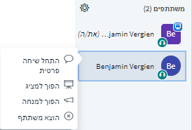

# יחסי גומלין

ועידת וידיאו ניזונה מיחסי הגומלין בין המשתתפים כולם. לפיכך, חשוב שיהיו אפשרויות ביטוי ותקשורת בדיוק כמו במפגש פרונטלי. BigBlueButton מציעה כלים אחדים שבשימוש בהם כראוי עשויים לתרום לשיח אינטראקטיבי פורה.

### צ'אט

ב-BigBlueButton יש שני סוגי צ'אט, ציבורי ופרטי:

הצ'אט הציבורי זמין מתחילתה של ועידת הווידיאו, וכל המשתתפים יכולים לצפות ולהשתמש בו. הוא נועד בעיקר להעלאת שאלות כלליות ולשליחת מידע לכל המשתתפים.

הצ'אט הפרטי – נפתח רק בלחיצה על שם ברשימת המשתתפים ובחירת האפשרות **"התחל שיחה פרטית"**. הצ'אטים הפרטיים נצפים בידי הצדדים המעורבים בלבד, והם מתאימים בעיקר לתיאומים מהירים בין מנחים.


הצ'אט הציבורי ניתן להורדה כקובץ טקסט בתפריט המשולש שבפינה הימנית למעלה בחלון הצ'אט.


### סטטוסים

סטטוסים מאפשרים ביטוי מנעד של רגשות בדרכים בלתי מילוליות וכן תקשורת עם משתתפים אחרים בוועידת הווידיאו. החליפו סטטוס בלחיצה על שמם ברשימת המשתתפים בלשונית "משתתפים" ובחרו סטטוס. הסטטוס יחליף את התמונה הקטנה, וכולם יוכלו לראות אותו. 


משתתפים אחרים או מנחים לא יקבלו התרעה קולית על שינוי הסטטוס. לדוגמה, אם אחד המשתתפים מרים את ידו, על המנחה לשים לב לזה בעצמו.


### פנקס משותף

הפנקס המשותף נגיש לכל המשתתפים לצפייה ולעריכה, בדומה לצ'אט הציבורי. ההבדל נעוץ בכך שאין אפשרות לשייך הערות לכותבים מסוימים וניתן לערוך את הערות בעורך HTML פשוט. הדבר מאפשר לסדר את ההערות בדרך משופרת ולערוך אותן סגנונית. הפנקס המשותף מתאים כפרוטוקול וכדי להעלות על הכתב מחשבות ורעיונות.


בדומה לצ'אט הציבורי, אפשר להוריד את הפנקס המשותף במבחר פורמטים – HTML, טקסט, PDF, וורד, ODF – בלחיצה על סמל ההורדה.


### סקרים / משאלים

BigBlueButton כוללת אפשרות לביצוע סקרים או חידונים פשוטים. אפשרות זו מוגבלת לשאלה אחת בו-זמנית \(שאלת חד-ברירה\). יש כמה סקרים מוגדרים מראש לבחירה, והמשתמשים יכולים גם להגדיר בעצמם סקר שבו עבור כל שאלה יוכלו לנסח עד חמש אפשרויות לתשובה. עם סיום הסקר ופרסום תוצאותיו, יכולים המשתתפים לעיין בהן.


רק למגישים הפעילים יש הרשאה ליצור סקרים. מנחה שאינו מגיש באותה עת יכול לשנות זאת בלחיצה על סמל הפלוס, אם כי צעד זה יפסיק את ההגשה של המגיש הנוכחי באותה נקודת זמן.


