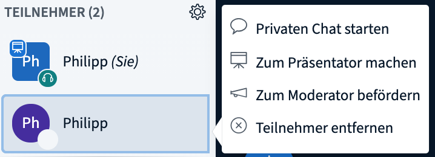
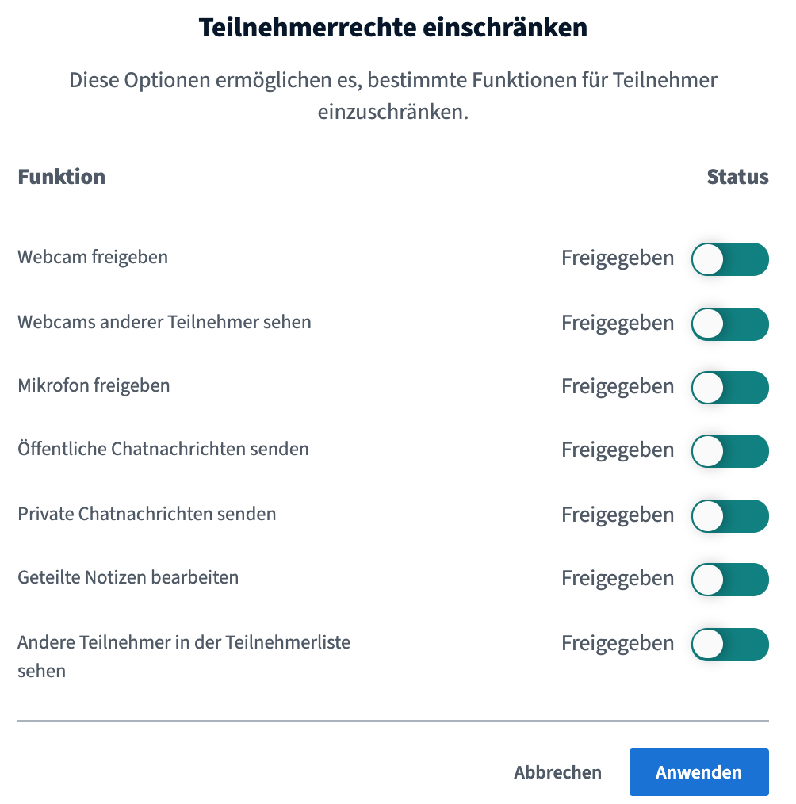
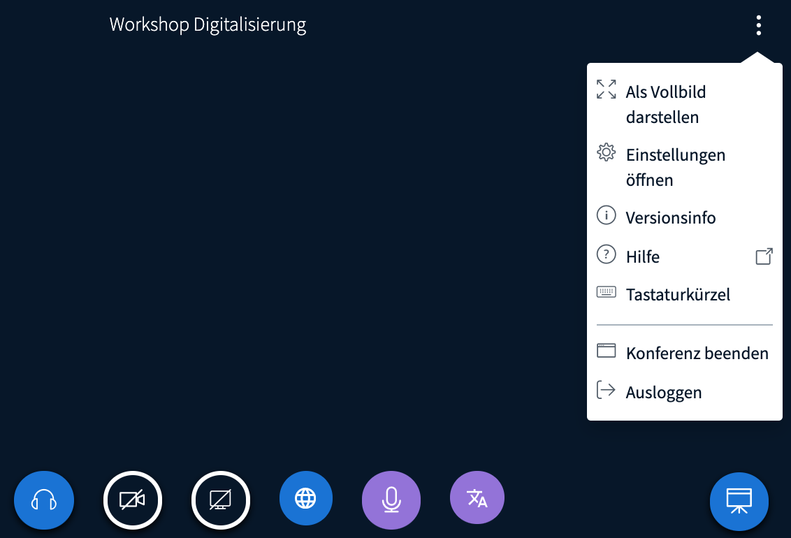
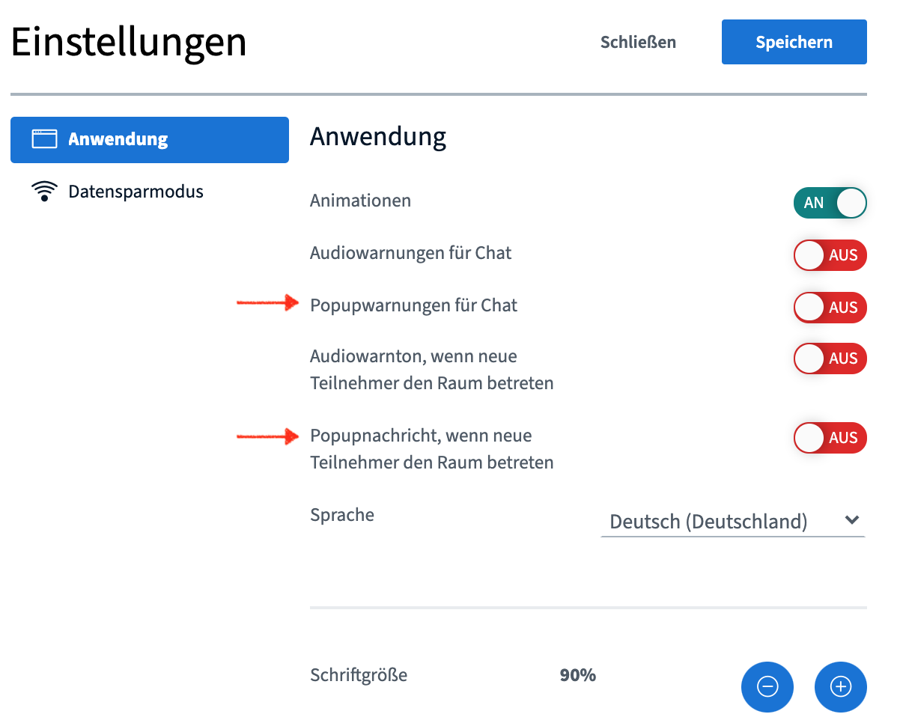
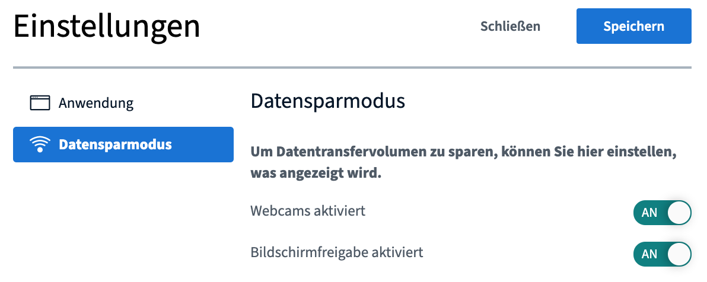

# Moderátorská práva

Tzv. moderátoři mají v BigBlueButton zvláštní práva, která je odlišují od běžných účastníků. Díky nim mohou spravovat videokonferenci i účastníky.

Moderátorem se můžete stát třemi způsoby:

* Všichni správci konference jsou automaticky moderátory všech jednotlivých videokonferencí.
* Při [vytváření událostí](../veranstaltungen-erstellen.md#praesentierende-referent-innen-moderator-innen-optional) mohou správci z jednotlivých účastníků učinit moderátory konkrétní události.
* V průběhu videokonference mohou moderátoři jmenovat další účastníky jako moderátory \(to platí pouze pro probíhající videokonferenci\).

V následujícím textu stručně vysvětlíme, jaké možnosti nastavení mají moderátoři v rámci probíhající videokonference.

### Správa účastníků

V zásadě existují dva způsoby správy účastníků. První se týká vždy konkrétní osoby, druhý má vliv na všechny účastníky videokonference.

**První možnost:** Klikněte na účastníka v seznamu účastníků.

Otevře se vám menu, ve kterém můžete:

1. zahájit soukromý chat,
2. **učinit z účastníka přednášejícího** \(bude moci sdílet obrazovku\),
3. **povýšit účastníka na moderátora** \(získá stejná práva jako moderátor\),
4. **odebrat účastníka z videokonference**.

**Druhá možnost:** Klikněte na ozubené kolečko vedle seznamu účastníků.

V tomto menu můžete:

1. resetovat stavové symboly všech účastníků a moderátorů,
2. vypnout mikrofon všem účastníkům,
3. vypnout mikrofon všem účastníkům kromě přednášejícího,
4. stáhnout si seznam všech jmen účastníků jako textový soubor \(.txt\), seřazený podle křestního jména či příjmení,
5. omezit práva účastníků \(viz níže, nevztahuje se na moderátory\).

### Správa videokonference

Kliknutím na symbol tří teček v pravém horním rohu se dostanete k obecným nastavením videokonference včetně jejího ukončení \(ukončení nemá trvalý účinek, konference se totiž znovu zahájí, jakmile do ní někdo vstoupí\).

V obecných nastaveních konference BigBlueButton najdete především volby, které vám usnadní moderování a interakci. Doporučujeme, abyste v případě větších skupin nebo diskuzí s otázkami povolili alespoň vyskakovací upozornění na nové zprávy v chatu a na příchod nových účastníků. Zajistí vám to lepší přehled a usnadní organizaci.

V záložce **Úspora datového přenosu** máte možnost deaktivovat používání webkamer a sdílení obrazovky v rámci celé konference. Za normálních okolností není potřeba tato nastavení měnit, může ale pomoci při problémech s rychlostí připojení.


V menu **Omezit práva účastníků** \(viz výše\) můžete také účastníkům \(nikoliv moderátorům\) zakázat používání webkamer a sdílení obrazovky.


### Přednášející / práva sdílet obrazovku

Kromě běžných účastníků a moderátorů rozlišuje BigBlueButton také roli přednášejícího. Prezentovat může současně vždy jen jedna osoba. Kdo toto právo aktuálně má, poznáte podle modrého symbolu projektoru u dané osoby v seznamu účastníků. Moderátoři mohou právo prezentovat přiřadit sami sobě kliknutím na symbol plus v okně videokonference. Mohou ho přiřadit i běžným účastníkům, a sice tak, že danou osobu vyberou v seznamu účastníků.

Přednášející může sdílet obrazovku i vytvářet a vyhodnocovat [ankety](interaktion.md#umfragen).

