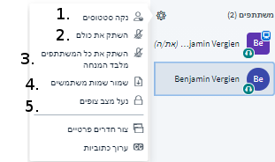
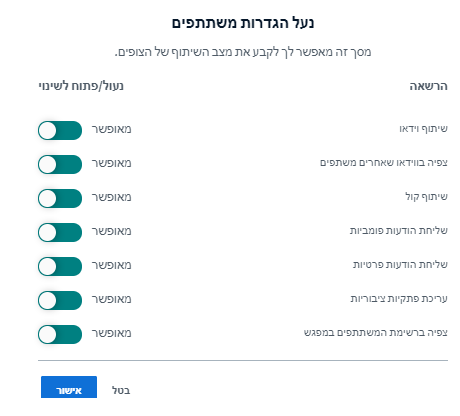
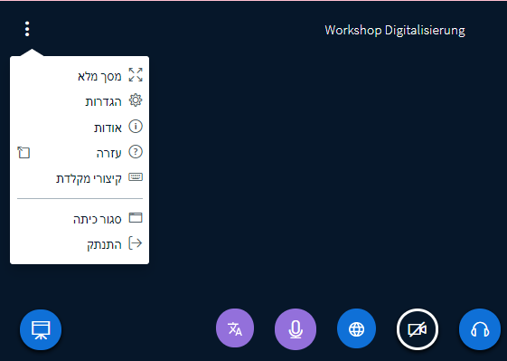
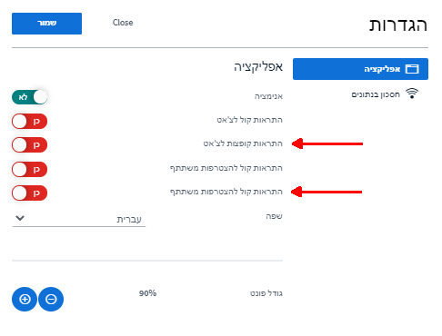
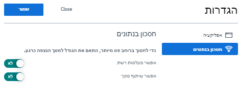
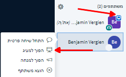

# הרשאות מנחה

למנחים ב-BigBlueButton \(BBB\) יש הרשאות מיוחדות המבדילות אותם משאר המשתתפים. אפשרויות אלה מקנות להם את היכולת לנהל את ועידת הווידיאו וגם את המשתתפים.

יש שלוש אפשרויות להפוך למנחה-BBB בבית המפגשים הדיגיטליים:

* •	כל האדמינים במפגש מתמנים אוטומטית גם כמנחים בכל ועידות הווידיאו
* •	אדמינים יכולים למנות משתתפים מסוימים למנחים של אירועים מוגדרים בעת יצירת האירועים.
* •	בעת ועידת וידיאו פעילה יכולים מנחים למנות משתתפים אחרים למנחים. המינוי יהיה תקף לאותה ועידת וידיאו פעילה בלבד.

אפשרויות ההגדרה העומדות לרשותם של המנחים בוועידת וידיאו פעילה:

### ניהול משתתפים

ככלל, יש שתי אפשרויות לניהול משתתפים. האחת מתייחסת למשתתף מסוים, והאחרת חלה על כל המשתתפים בוועידת הווידיאו. 

**אפשרות ראשונה:** בלחיצה על שמו של משתתף מסוים ברשימת המשתתפים

ייפתח תפריט ובו אפשרויות אלה:

1. 1.	להתחיל בצ'אט פרטי
2. 2.	**למנות את המשתתף למגיש / מציג** \(למשתתף תהיה הרשאה לפצל את המסך\)
3. 3.	**לקדם את המשתתף לתפקיד מנחה** \(הרשאותיו של המשתתף יהיו זהות לאלה של המנחה\).
4. 4.	**להוציא את המשתתף מוועידת הווידיאו**

**אפשרות שנייה:** פתיחת תפריט ההגדרות שליד רשימת המשתתפים.

כאן אפשר:

1. 1.	לאפס את הסטטוסים של כל המשתתפים והמנחים
2. 2.	להשתיק את המיקרופונים של כל המשתתפים
3. 3.	להשתיק את המיקרופונים של כל המשתתפים חוץ מזה של המגיש
4. 4.	להוריד את שמות כל המשתתפים כקובץ טקסט \(.txt\) \(לפי שם פרטי או לפי שם משפחה\)
5. 5.	להגביל את הרשאות המשתתפים \(ראו להלן; לא חל על מנחים\).

### ניהול ועידת וידיאו

בתפריט המשולש בצד שמאל למעלה אפשר לקבוע הגדרות כלליות לוועידת הווידיאו וכן לסיים את הוועידה, אם כי ב-DINA אין לכך השפעה ממושכת, שכן הוועידה תותחל מחדש כשמשתתף יבקש להצטרף.

בהגדרות הכלליות של ועידת BigBlueButton נכללות בעיקר אפשרויות המקלות על המנחים ועל האינטראקציה. בקבוצות גדולות יחסית ובסבבי שאלות מומלץ להפעיל את ההתרעות הקופצות, לפחות בעת קבלת הודעות חדשות בצ'אט ובהצטרפות של משתתפים חדשים. הדבר מקל על הסדר ומסייע בליווי הקבוצה.

נוסף על כך, בלשונית **"חיסכון בנתונים"** יש האפשרות לחסום את מצלמות הרשת ואת פתיחת המסך לכל משך הוועידה. בדרך כלל, רצוי שלא לשנות הגדרות אלה, אם כי הדבר עשוי להועיל במקרה של קשיי התחברות.


אפשר לחסום מצלמות רשת ומסכים למשתתפים בלבד, אך לא למנחים \(ראו לעיל\), באמצעות התפריט **"הרשאות משתתפים"**.


### הרשאות מגיש / מציג לפתיחת מסכים


BigBlueButton מבדילה לא רק בין משתתפים לבין מנחים, היא משתמשת גם בקטגוריית מגיש / מציג. בכל זמן נתון, אדם אחד בלבד יכול להגיש. סמל המקרן הכחול בתמונת המשתתף מסמן את בעל הרשאה זו באותה נקודת זמן. מנחים יכולים להעניק לעצמם את הרשאת המגיש בלחיצה על סמל הפלוס בחלון הווידיאו. כמו כן באפשרותם להעניק הרשאה זו למשתתפים מן המניין בבחירת שם מתוך רשימת במשתתפים.

המגיש רשאי לפצל את המסך ואף ליצור סקרים ולנתחם

