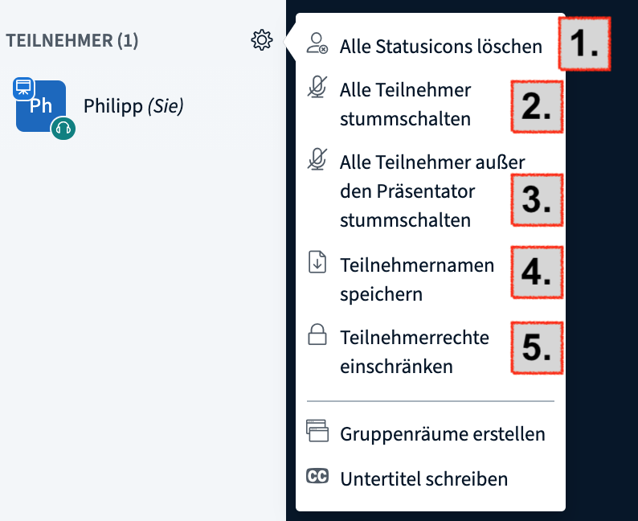
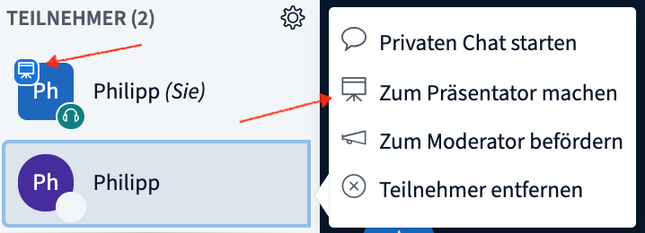

# Δικαιώματα Συντονιστών

Οι επονομαζόμενοι συντονιστές διαθέτουν συγκεκριμένα δικαιώματα στο BigBlueButton, τα οποία τους διαχωρίζουν από τους κανονικούς συμμετέχοντες. Με τις εν λόγω επιλογές έχουν τη δυνατότητα να διαχειριστούν την τηλεδιάσκεψη καθώς και τους συμμετέχοντες.

Στο ψηφιακό συνεδριακό κέντρο υπάρχουν τρεις τρόποι για να γίνετε/είστε συντονιστής στο BBB:

* Σε όλες τις τηλεδιασκέψεις όλοι οι διαχειριστές μιας συνάντησης είναι αυτόματα και συντονιστές. 
* Οι διαχειριστές μπορούν να ορίσουν μεμονωμένα άτομα ως συντονιστές μιας συγκεκριμένης εκδήλωσης, όταν [δημιουργούν τις εκδηλώσεις](https://app.gitbook.com/@dina-international/s/manual/v/gre/funktionalitaeten/veranstaltungen-erstellen).
* Κατά τη διάρκεια της τρέχουσας τηλεδιάσκεψης, οι συντονιστές μπορούν να ορίσουν άλλους συμμετέχοντες ως συντονιστές \(αυτό εφαρμόζεται μόνο στη συγκεκριμένη τρέχουσα τηλεδιάσκεψη\).

Στη συνέχεια, θα εξηγήσουμε επιγραμματικά ποιες επιλογές \(ρυθμίσεων\) διαθέτουν οι συντονιστές κατά τη διάρκεια της τρέχουσας τηλεδιάσκεψης.

**Διαχείριση συμμετεχόντων**

Υπάρχουν, κατά βάση, δύο τρόποι διαχείρισης των συμμετεχόντων. Ο πρώτος σχετίζεται με ένα συγκεκριμένο άτομο, ενώ ο δεύτερος επηρεάζει όλους τους συμμετέχοντες της τηλεδιάσκεψης.

**Πρώτη επιλογή:** Κάντε κλικ πάνω σε κάποιον συμμετέχοντα στη λίστα συμμετεχόντων.

Εκεί, ανοίγει ένα μενού μέσω του οποίου μπορείτε:

1. να ξεκινήσετε μια προσωπική συνομιλία,
2. **να μετατρέψετε τον συμμετέχοντα σε παρουσιαστή** \(ο συμμετέχων επιτρέπεται να κάνει κοινή χρήση της οθόνης,
3. **να αναβαθμίσετε τον συμμετέχοντα σε συντονιστή** \(ο συμμετέχων διατηρεί τα ίδια δικαιώματα με τον συντονιστή\),
4. **να αφαιρέσετε τον συμμετέχοντα από την τηλεδιάσκεψη.**

**Δεύτερη επιλογή:** Ανοίγετε το μενού γρανάζι δίπλα στη λίστα συμμετεχόντων.

Εδώ, μπορείτε να κάνετε τα ακόλουθα:

1. Να επαναρυθμίσετε τα εικονίδια κατάστασης όλων των συμμετεχόντων και των συντονιστών
2. Να απενεργοποιήσετε τον ήχο όλων των συμμετεχόντων
3. Να απενεργοποιήσετε τον ήχο όλων των συμμετεχόντων εκτός από του παρουσιαστή
4. Να κατεβάσετε όλα τα ονόματα των συμμετεχόντων ως αρχείο κειμένου \(.txt\) \(ταξινομημένα κατά κύριο όνομα και επώνυμο\)
5. Να περιορίσετε τα δικαιώματα των συμμετεχόντων \(βλέπε παρακάτω, δεν εφαρμόζεται για τους συντονιστές\).

**Διαχείριση τηλεδιάσκεψης**

Το μενού 3 σημείων στην πάνω δεξιά γωνία μπορεί να χρησιμοποιηθεί, για να κάνετε γενικές ρυθμίσεις για την τηλεδιάσκεψη καθώς και για να λήξετε το συνέδριο \(αυτή η λειτουργία δεν έχει μόνιμα αποτελέσματα στην πλατφόρμα DINA, αλλά μπορεί να υποστεί επανεκκίνηση κάθε φορά που κάποιος θέλει να συμμετάσχει\).

Στις καθολικές ρυθμίσεις του συνεδρίου BigBlueButton θα βρείτε τα χαρακτηριστικά που θα διευκολύνουν τον συντονισμό και τη διάδραση. Για τις μεγάλες ομάδες ή για τις συνεδρίες ερωταπαντήσεων, συστήνουμε να ενεργοποιήσετε τουλάχιστον τις αναδυόμενες ειδοποιήσεις, έτσι ώστε να έχετε πρόσβαση σε νέα μηνύματα στη ζωντανή συνομιλία, καθώς και όταν εισέρχονται οι συμμετέχοντες. Αυτό θα σας βοηθήσει να έχετε τον έλεγχο του τι συμβαίνει και θα συμβάλλει στην επίβλεψη της ομάδας.

Στην καρτέλα **Λειτουργία αποθήκευσης δεδομένων** μπορείτε να απενεργοποιήσετε τις κάμερες και την κοινή χρήση οθόνης για όλο το συνέδριο. Κανονικά, δεν θα πρέπει να τροποποιούνται οι εν λόγω ρυθμίσεις, ωστόσο αυτό θα μπορούσε να αποδειχθεί χρήσιμο σε περίπτωση δυσκολιών σύνδεσης.


Επιπλέον, είναι εφικτός ο αποκλεισμός των καμερών και της κοινής χρήσης οθόνης μόνο για τους συμμετέχοντες και όχι για τους συντονιστές μέσω του μενού **Περιορισμός δικαιωμάτων συμμετεχόντων** \(βλέπε πάνω\).


**Παρουσιαστής / Δικαιώματα κοινής χρήσης οθόνης**

Το BigBlueButton διαχωρίζει τους απλούς συμμετέχοντες από τους συντονιστές καθώς και από τους παρουσιαστές. Κάθε φορά μπορεί να παρουσιάζει μόνο ένα άτομο. Όποιος έχει κάθε φορά αυτό το δικαίωμα, θα εμφανίζεται ένας μικρός μπλε προτζέκτορας στη φωτογραφία του ατόμου στη λίστα συμμετεχόντων. Οι συντονιστές μπορούν να χορηγήσουν το δικαίωμα παρουσίασης, κάνοντας κλικ στο σύμβολο συν στο παράθυρο του βίντεο. Επιπροσθέτως, μπορούν να χορηγήσουν το εν λόγω δικαίωμα και σε απλούς συμμετέχοντες, επιλέγοντας το όνομα του αντίστοιχου ατόμου στη λίστα συμμετεχόντων.

Ο παρουσιαστής έχει το δικαίωμα να κάνει κοινή χρήση της οθόνης τους καθώς και να δημιουργήσει και να αξιολογήσει [δημοσκοπήσεις](https://app.gitbook.com/@dina-international/s/manual/v/gre/funktionalitaeten/bigbluebutton/interaktion).

