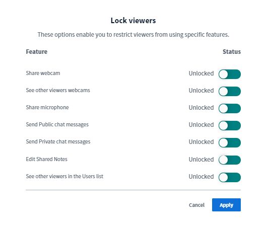

# Moderator Rights

So-called moderators have special rights in BigBlueButton that distinguish them from the normal participants. With these options they can manage the video conference as well as the participants.

There are three ways to become/be a BBB moderator in the digital conference centre:

* All administrators of a meeting are automatically moderators in all videoconferences.
* Admins can appoint individual participants as moderators of the specific event when creating events.
* During an ongoing videoconference, moderators can appoint other participants as moderators \(this only applies to that ongoing videoconference\).

In the following, we will briefly explain which \(setting\) options moderators have in an ongoing videoconference.

### Managing participants

In principle, there are two ways of managing participants, the first relating to a specific person and the second having an impact on all participants of the video conference.

**First option:** Click on a participant in the list of participants.

A menu opens in which you can:

1. Start a private chat,
2. **Make the participant the presenter** \(participant is allowed to share the screen\). 3,
3. **Promote the participant to moderator** \(participant obtains the same rights as the moderator\),
4. **Remove the participant from the video conference.**

**Second option:** Open the cogwheel menu next to the participant list.

Here, you can do the following:

1. Reset the status icons of all participants and moderators
2. Mute all participants
3. Mute all participants except the presenter
4. Download all participants' names as a text file \(.txt\) \(sorted by both first and last name\)
5. Restrict the rights of the participants \(see below, does not apply to moderators\).

### Managing a video conference

The 3-point menu in the top right-hand corner can be used to make general settings for the video conference and to end the conference \(this has no lasting effect with DINA, however, as it is restarted as soon as someone wants to join\).

In the global settings of the BigBlueButton conference you will find features that facilitate moderation and interaction. We recommend that for larger groups or Q&A sessions, at least the pop-up notifications are switched on for new messages in the chat and when participants join. This helps keep track of what is going on and helps with the supervision of the group.

In the **Data saving mode** tab it is also possible to deactivate webcams and screen sharing for the entire conference. Normally, these settings should remain untouched, however, they may be useful in case of connection difficulties.


It is also possible to block webcams and screen sharing for participants only and not for moderators via the menu **Restrict participant rights** \(see above\).


### Presenter / screen sharing rights

BigBlueButton distinguishes between normal participants and moderators as well as the presenters. Only one person can present at a time. Whoever currently has the right is indicated by a small blue projector symbol in the picture of the person in the participant list. Moderators can assign themselves the presenter right by clicking on the plus symbol in the video window. They can also assign this right to normal participants by selecting the name of the corresponding person in the participant list.

The presenter is allowed to share their screen and to create and analyse surveys.

