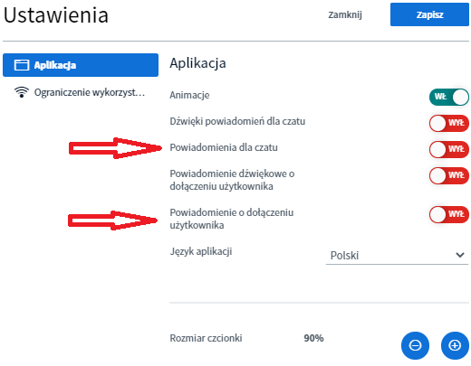

# Moderator\*innen Rechte

Sogenannte Moderator\*innen haben in BigBlueButton Sonderrechte, die sie von den normalen Teilnehmenden abheben. Mit diesen Optionen haben sie die Möglichkeit, die Videokonferenz und auch die Teilnehmenden zu verwalten. 

Im digitalen Tagungshaus gibt es drei Möglichkeiten zur BBB-Moderator\*in zu werden/sein:

* Alle Administrator\*innen einer Tagung sind automatisch Moderator\*innen in sämtlichen Videokonferenzen
* Admins können beim [Erstellen von Veranstaltungen](../veranstaltungen-erstellen.md#praesentierende-referent-innen-moderator-innen-optional) einzelne Teilnehmende zu Moderator\*innen der spezifischen Veranstaltung ernennen.
* Während einer laufenden Videokonferenz können Moderator\*innen andere Teilnehmende zu Moderator\*innen ernennen \(dies gilt dann nur für die laufende Videokonferenz\).

Im folgenden erklären wir kurz, welche \(Einstellungs-\)Möglichkeiten Moderator\*innen in einer laufenden Videokonferenz besitzen.

### Teilnehmende verwalten

Grundsätzlich gibt es zwei Möglichkeiten Teilnehmende zu verwalten, wobei sich die erste auf eine bestimmte Person bezieht und die zweite Auswirkungen auf alle Teilnehmenden der Videokonferenz hat. 

**Erste Möglichkeit:** Auf einen Teilnehmenden in der Teilnehmerliste klicken.

Es öffnet sich ein Menü, indem man:

1. Einen privaten Chat starten,
2. Den **Teilnehmenden zum Präsentierenden machen** \(TN darf Bildschirm teilen\),
3. Den **Teilnehmenden zur Moderator\*in befördern** \(TN erhält die gleichen Rechte wie die Moderator\*in\),
4. Den **Teilnehmenden aus der Videokonferenz entfernen** kann.

**Zweite Möglichkeit:** Das Zahnradmenü neben der Teilnehmerliste öffnen.

Hier lassen sich:

1. Die Status-Symbole aller Teilnehmenden und Moderator\*innen zurücksetzen,
2. Alle Teilnehmenden stumm schalten,
3. Alle Teilnehmenden außer des Präsentierenden stumm schalten,
4. Alle Namen der Teilnehmenden als Textdatei \(.txt\) herunterladen \(sortiert sowohl nach Vor- und Nachname\),
5. Die Rechte der Teilnehmenden einschränken \(s.u., gilt nicht für Moderator\*innen\).

### Videokonferenz verwalten

Über das 3-Punkt-Menü oben rechts in der Ecke lassen sich generelle Einstellungen für die Videokonferenz vornehmen und die Konferenz beenden \(dies hat bei DINA jedoch keinen nachhaltigen Effekt, da sie erneut gestartet wird, sobald jemand beitreten möchte\).

In den globalen Einstellungen der BigBlueButton Konferenz finden sich vor allem Erleichterungen für die Moderation und Interaktion. Wir empfehlen, dass bei größeren Gruppen oder Fragerunden zumindest die Pup-up Benachrichtigungen bei neuen Nachrichten im Chat und bei Beitritt von Teilnehmenden eingeschaltet werden. Dies bewahrt den Überblick und hilft bei der Betreuung der Gruppe.

Im Reiter **Datensparmodus** gibt es außerdem noch die Möglichkeit Webcams und das Freigeben des Bildschirms für die gesamte Konferenz zu deaktivieren. Im Normalfall sollten diese Einstellungen unberührt bleiben, können aber bei Verbindungsschwierigkeiten von Nutzen sein.


Es ist auch möglich über das Menü **Teilnehmerrechte einschränken** die Webcams und Bildschirmfreigabe nur für Teilnehmende und nicht für Moderator\*innen zu sperren \(s.o.\).


### Präsentator\*in / Rechte zur Bildschirmfreigabe

BigBlueButton unterscheidet neben normalen Teilnehmenden und Moderator\*innen auch noch den/die Präsentator\*in. Es kann immer nur eine Person gleichzeitig präsentieren. Wer gerade das Recht aktuell besitzt, zeigt sich an einem kleinen blauen Projektor-Symbol im Bild der Person in der Teilnehmerliste. Moderator\*innen können sich selbst das Präsentator-Recht zuweisen, indem sie auf das Plus-Symbol im Videofenster klicken. Normalen Teilnehmenden können sie dieses Recht ebenfalls zuteilen, indem sie den Namen der entsprechenden Person in der Teilnehmerliste anwählen.

Der/Die Präsentator\*in darf zum einen den Bildschirm teilen und zum anderen [Umfragen](interaktion.md#umfragen) anlegen und auswerten.

