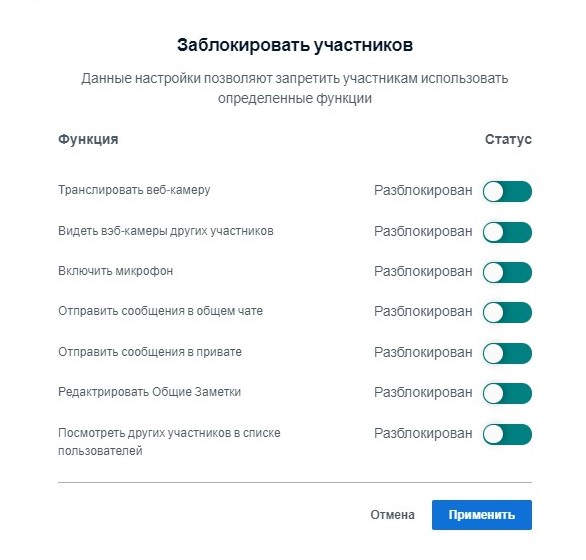

# Права модераторов

Так называемые модераторы наделены в BigBlueButton особыми правами, которые отличают их от обычных участников. С помощью этих опций они могут управлять видеоконференцией и ее участниками.

В цифровом конференц-центре есть три способа, чтобы стать/быть модератором BBB:

* Все администраторы конференции автоматически являются модераторами всех видеоконференций.
* При создании мероприятий администраторы могут назначать отдельных участников модераторами конкретного мероприятия.
* Во время текущей видеоконференции модераторы могут назначать других участников модераторами \(но только на время текущей видеоконференции\).

В последующем мы кратко объясним, какими возможностями \(для настроек\) обладают модераторы на текущей видеоконференции.

### Управление участниками

Принципиально существуют два способа управления участниками: первый касается конкретного человека, а второй имеет последствия для всех участников видеоконференции.

**Первый вариант:** кликнуть на участника в списке участников.

Открывается меню, в котором можно:

1. Начать приватный чат;
2. **Сделать участника ведущим** \(участник вправе демонстрировать свой экран\);
3. **Повысить участника до статуса модератора** \(участник наделяется теми же правами, что и модератор\);
4. **Удалить участника из видеоконференции**. 

**Второй вариант:** открыть меню настройки рядом со списком участников.

Здесь можно:

1. сбрасывать иконки статуса всех участников и модераторов;
2. выключать микрофоны всех участников; 
3. выключать микрофоны всех участников, кроме микрофона презентующего;
4. скачивать имена всех участников в виде текстового файла \(.txt\) \(отсортированного как по имени, так и по фамилии\);
5. ограничивать права участников \(см. ниже, это не распространяется на модераторов\). 

### Управление видеоконференцией

Три точки в правом верхнем углу - это меню, которое позволяет произвести общие настройки для видеоконференции и завершить конференцию \(что, однако, не имеет устойчивого эффекта на платформе DINA, так как она вновь начнется, если кто-то желает присоединиться к конференции\).

В глобальных настройках конференции BigBlueButton находятся прежде всего опции, облегчающие модерирование и управление. В случае крупных групп или сессий вопросов и ответов мы рекомендуем активировать хотя бы функцию «Всплывающие уведомления» для новых сообщений в чате и подключения участников конференции. Это позволяет сохранять ориентацию и помогает в работе с группой.

Во вкладке **«Режим экономии данных»** также предусмотрена возможность деактивации видеокамер и режима разделения экрана для всей конференции. Обычно эти настройки рекомендуется не использовать, но они могут быть полезными в случае проблем со связью.


Меню **«Ограничить права участников»** также предлагает опцию блокировки видеокамер и разделения экрана только для участников, но не для модераторов \(см. выше\).


### Презентующий / Права на разблокировку экрана

BigBlueButton различает обычных участников, модераторов и презентующих. Проводить презентацию всегда может только одно лицо. Лицо, актуально наделенное этим правом, указывается с помощью маленького синего символа проектора на изображении соответствующего лица в списке участников. Одновременно модераторы могут самостоятельно наделять себя правом презентующего, кликнув на символ плюса в видеоокне. Этим правом они также могут наделять обычных участников, выбирая имя соответствующего лица в списке участников.

Презентующий имеет право разделить экран, а также создавать и анализировать опросы.

