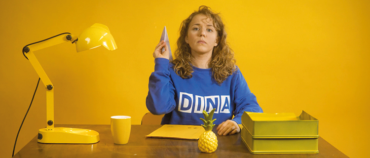
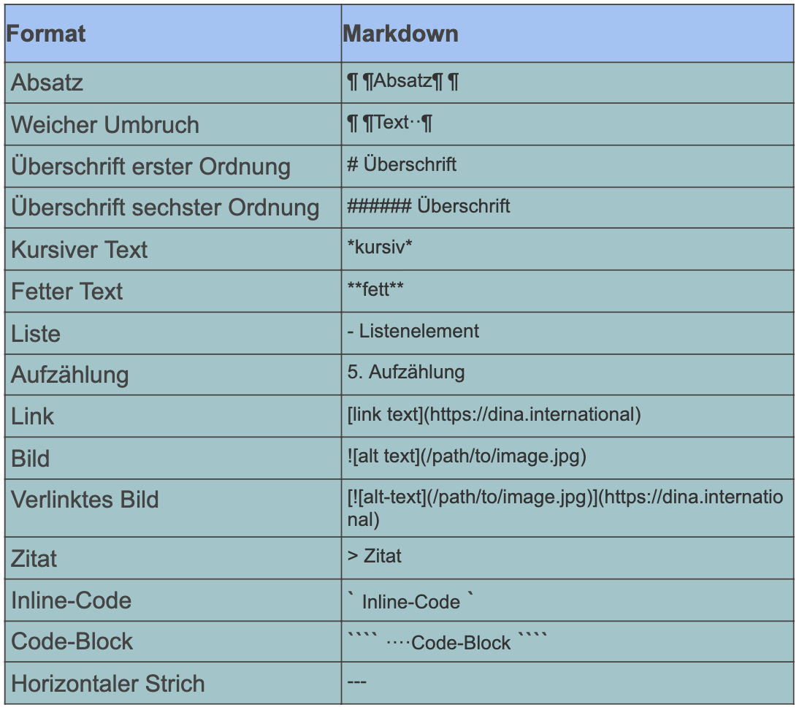

# Event Rooms

If you think of the conference as a kind of building, then of course we need rooms in it where you can meet and hold events. Given that you will always be coordinating together anyway, maybe only one room is enough for very small meetings. However, especially if you want to run several events at the same time, it is useful to have \(thematically\) separate areas. There could, for instance, be rooms divided according to teams or groups, according to \(work\) topics or interests. In the following, we will explain how you can fill your conference building with rooms.


Rooms per se do not have a video function. They only provide the necessary 'context' for the events taking place in them. These in turn provide a video function, depending on the type of room.


### Adding new rooms

To add new rooms, you first need to go to the conference admin page. From here, click on the tab **"Manage conference rooms"**. In the right-hand corner you will find the button **"Create room"** and a list of the rooms that have already been created. When you click on "Create room", the options menu for the new room opens. Some of the terms in it may be self-explanatory but we will nevertheless briefly show you below which settings can be made when creating a room.

### Room settings

#### Room type

Every room in your conference is of a specific type. You could also say: it has a certain basic equipment. Each room type therefore offers different possibilities and advantages as shown in the following table:

| Room type | Options |
| :--- | :--- |
| Lobby | The lobby should be the entry point for the participants. It could also be called a reception or info point. It is therefore well suited for instructions and announcements. In addition, all events during the conference are automatically linked here as an agenda. _A lobby should ideally exist only once and have the sorting number 1 to ensure that it is displayed as the first room._ |
| Stage | A video stream is integrated in a stage room \(e.g., YouTube or Vimeo\). In addition, a chat for discussion can be displayed on the right-hand side. Integration of other, external tools via "embedding code" is also possible \(provided the third-party providers allow you to do so\). Later, there will also be the possibility to stream from other rooms to the stage. This is well suited for inputs where the main focus should be on the presentation\). |
| Workshops | As the name suggests, a workshop room is well suited for interactive, collaborative work. Each event in a workshop room has its own video conference with all the options offered by BigBlueButton. Events are displayed as tiles. |
| Discussions | Discussion rooms have the same functions as workshop rooms, except that the events are displayed as a list rather than as tiles. |
| Café | The café is designed to facilitate informal exchange and bring participants together at virtual café tables. Events in a café room can be provided with a picture and fulfil the task of small group tables. |
| Results | The results room is not really a real room. It is a link to a project on the DINA platform \(the project is specifically created for the conference\). This project can be directly edited via the conference platform without opening a new page in the browser. This is where you can collect results, conduct surveys, distribute tasks, etc. |
| List of participants | The list of participants is also not a typical room, rather it integrates a list of participants into the conference view. In addition to the displayed name, institution and country of origin, you may also send each other direct messages via Rocket.Chat. \(list extension option is planned.\) |

#### Title

The title is the room name that is displayed to the participants during the conference. It can be descriptive, such as Café or Auditorium, or metaphorical, such as Feast Land or Indian tipi. There are no bounds to your imagination.

#### Sorting number

The sorting number of a room determines where the room is displayed to the participants from top to bottom. For example, if you want the rooms to be displayed in the following order: 1. info point, 2. plenary, 3. café, 4. list of participants, you have to number the rooms accordingly.


You can also leave gaps in the numbering, if you are unsure whether more rooms will be needed later \(e.g. 1, 2, 5, 6\). A lobby room should have the sorting number 1, so that it is displayed in the first position.


#### Description \(optional\) 

The description of a room appears above the events taking place in the room. If the name of the room is self-explanatory, you can omit the description. However, it is useful, for example, to briefly introduce the individual events or to define the rules of the discussion in advance.


The editor for the description is a Markdown editor. At first glance, it seems more complicated than it is. If, for example, you want to write text in **bold**, then simply \*\***frame\*\*** it at the front and end with two asterisks. You can find more information on Markdown syntax here.


#### Room and chat visibility

Finally, you can specify whether the room should be displayed to the participants and whether the room-specific chat window should be available. Both settings can also be changed later after you have created and saved the room.


For meetings lasting several days, it can be useful to hide rooms that are only needed later. This makes it easier for participants to find their way around and no one will accidentally get lost 😉.


Once you have made all the settings, the room is created by clicking on the "Save" button. It is now available immediately on the conference page.

### Editing rooms

There are two ways of editing existing rooms. The first is via the Admin page from where all conference settings can be adjusted. There, you click on the tab **"Manage conference rooms"** and select the desired room.

The second option is accessible directly from the conference view: administrators can open room editing directly from there, provided they are in that particular room, and can also create or edit new events for this room. In addition, the button **"Edit rooms"** can be found at the bottom left of the conference view which leads to the room management \(see above\). In room editing, all the settings described above, except for the room type, can be changed and are visible immediately after saving.

### Deleting rooms

Deleting a room works in a similar way to editing it: From the Admin page, select the Manage conference rooms tab and open the drop-down menu of the room to be deleted. There you will find the button to delete.

If you are currently in the conference view, simply enter the room in question and select the "Delete room" button below the room description.


Deleting a room also deletes all events scheduled in it and cannot be reversed.


