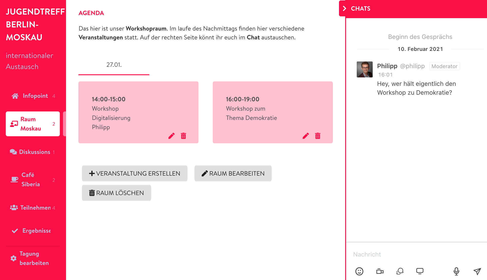

# Veranstaltungsräume

Wenn Du dir die Tagung als eine Art Gebäude vorstellst, dann brauchen wir in diesem natürlich auch Räume, in denen ihr euch treffen und Veranstaltungen durchführen könnt. Bei ganz kleinen Treffen reicht vielleicht nur ein Raum, da ihr euch sowieso immer gemeinsam absprecht. Gerade wenn jedoch mehrere [Veranstaltungen](../veranstaltungen-erstellen.md) parallel laufen sollen, dann sind \(thematisch\) getrennte Bereiche sinnvoll. Es könnte zum Beispiel Räume nach Teams oder Gruppen, nach \(Arbeits-\)Thema oder Interessen geben. Im folgenden erklären wir Dir, wie Du dein Konferenzgebäude mit Räumen füllst.


Räume an sich besitzen keine Videofunktion. Sie sind nur der notwendige "Kontext" für die darin stattfindenden [Veranstaltungen](../veranstaltungen-erstellen.md). Diese wiederum stellen, je nach Raumtyp, eine [Videofunktion](../bigbluebutton/) bereit.


### Neue Räume hinzufügen

Um neue Räume hinzuzufügen, muss zunächst die [Admin Seite](../admin-page.md) der Tagung aufgerufen werden. Hier angekommen klickst Du auf den Reiter "**Tagungsräume verwalten**". Rechts in der Ecke findet sich nun der Button "**Raum erstellen**" und eine Auflistung der bereits erstellten Räume. Nach dem Klick auf "Raum erstellen" öffnet sich das Optionsmenü für den neuen Raum. Einige Begriffe darin sind vielleicht selbst erklärend, trotzdem zeigen wir Dir hier kurz auf, welche Einstellungen bei der Raumerstellung vorgenommen werden können.

### Raumeinstellungen

#### Raumtyp

Jeder Raum in Deiner Tagung hat einen bestimmten Typ. Man könnte auch sagen: eine bestimmte Grundausstattung. Jeder Raumtyp bringt somit verschiedene Möglichkeiten und Vorteile mit sich, welche die folgende Tabelle zeigt: 

<table>
  <thead>
    <tr>
      <th style="text-align:left">Raumtyp</th>
      <th style="text-align:left">M&#xF6;glichkeiten</th>
    </tr>
  </thead>
  <tbody>
    <tr>
      <td style="text-align:left">Lobby</td>
      <td style="text-align:left">Die Lobby soll der Einstiegspunkt f&#xFC;r die Teilnehmenden sein. Man
        k&#xF6;nnte sie auch als Empfang oder Infopoint bezeichnen. Deshalb eignet
        sich gut f&#xFC;r Hinweise und Ansagen. Au&#xDF;erdem werden hier automatisch
        alle <a href="../veranstaltungen-erstellen.md">Veranstaltungen</a> innerhalb
        der Konferenz in Form einer Agenda verlinkt. <em>Eine Lobby sollte es am besten nur einmal geben und die </em>
        <a
        href="./#sortiernummer"><em>Sortiernummer</em>
          </a><em> 1 besitzen, damit sie als erster Raum angezeigt wird.</em>
      </td>
    </tr>
    <tr>
      <td style="text-align:left">B&#xFC;hne</td>
      <td style="text-align:left">
        
In einem B&#xFC;hnenraum wird ein Videostream eingebunden (z.B. Youtube
          oder Vimeo). Au&#xDF;erdem kann auf der rechten Seite ein Chat zur Diskussion
          angezeigt werden.

        
Auch eine Einbindung weiterer, externer Tools per &quot;Embedding-Code&quot;
          ist m&#xF6;glich (sofern die Drittanbieter dies zulassen). Sp&#xE4;ter
          soll es auch die M&#xF6;glichkeit geben, aus anderen R&#xE4;umen auf die
          B&#xFC;hne zu streamen. Dies eignet sich gut f&#xFC;r Inputs, wo der Fokus
          besonders auf der Pr&#xE4;sentation liegen soll).

      </td>
    </tr>
    <tr>
      <td style="text-align:left">Workshops</td>
      <td style="text-align:left">Wie der Name schon sagt, eignet sich ein Workshopraum gut f&#xFC;r interaktives,
        kollaboratives Arbeiten. Jede <a href="../veranstaltungen-erstellen.md">Veranstaltung</a> in
        einem Workshopraum erh&#xE4;lt eine eigene <a href="../bigbluebutton/">Videokonferenz</a> mit
        all den M&#xF6;glichkeiten von BigBlueButton. Veranstaltungen werden als
        Kacheln angezeigt.</td>
    </tr>
    <tr>
      <td style="text-align:left">Diskussionen</td>
      <td style="text-align:left">Diskussionsr&#xE4;ume haben die gleichen Funktionen wie Workshopr&#xE4;ume,
        allerdings werden die Veranstaltungen nicht als Kacheln, sondern als Liste
        angezeigt.</td>
    </tr>
    <tr>
      <td style="text-align:left">Caf&#xE9;</td>
      <td style="text-align:left">Das Caf&#xE9; soll informellen Austausch erm&#xF6;glichen und Teilnehmende
        an virtuellen Caf&#xE9;tischen zusammenbringen. Veranstaltungen in einem
        Caf&#xE9;-Raum k&#xF6;nnen mit einem Bild versehen werden und erf&#xFC;llen
        die Aufgabe von kleinen Gruppentischen.</td>
    </tr>
    <tr>
      <td style="text-align:left">Ergebnisse</td>
      <td style="text-align:left">Der <a href="ergebnisraum.md">Ergebnisraum</a> ist eigentlich gar kein Raum,
        sondern ein Link zu einem Projekt auf der DINA Plattform (das Projekt wird
        f&#xFC;r die Tagung neu angelegt). Dieses Projekt kann dadurch direkt &#xFC;ber
        die Konferenzplattform bearbeitet werden, ohne eine neue Seite im Browser
        zu &#xF6;ffnen. Hier lassen sich Ergebnisse sammeln, Umfragen durchf&#xFC;hren,
        Aufgaben verteilen, etc.</td>
    </tr>
    <tr>
      <td style="text-align:left">Teilnehmendenliste</td>
      <td style="text-align:left">Die Teilnehmendenliste ist ebenfalls kein typischer Raum, sondern bindet
        eine Liste der Teilnehmenden in die Konferenzansicht ein. Neben dem angezeigten
        Namen, der Institution und dem Herkunftsland besteht hier au&#xDF;erdem
        noch die M&#xF6;glichkeit, sich gegenseitig Direktnachrichten &#xFC;ber
        Rocketchat zu schicken. (eine Erweiterbarkeit der Liste ist in Planung)</td>
    </tr>
  </tbody>
</table>

#### Titel

Der Titel ist der Raumname, welcher den Teilnehmenden während der Konferenz angezeigt wird. Dieser kann beschreibend sein, wie zum Beispiel Café oder Auditorium, oder auch metaphorisch wie Schlemmerland oder Indianerzelt lauten. Deiner Fantasie sind hier keine Grenzen gesetzt.

#### Sortiernummer

Die Sortiernummer eines Raumes bestimmt, an welcher Stelle der Raum für die Teilnehmenden, von oben nach unten gelesen, angezeigt wird. Willst Du beispielsweise, dass die Räume in der Reihenfolge: 1. Infopoint, 2. Plenum, 3. Café, 4. Teilnehmendenliste angezeigt werden, dann musst Du die Räume entsprechend nummerieren. 


Du kannst auch Lücken in der Nummerierung lassen, falls Du dir unsicher bist, ob später noch mehr Räume benötigt werden \(z.B. 1, 2, 5, 6\). Ein Lobbyraum sollte die Sortiernummer 1 besitzen, damit er an erster Stelle angezeigt wird.


#### Beschreibung \(optional\) 

Die Beschreibung eines Raumes erscheint über den im Raum stattfindenden Veranstaltungen. Falls der Name des Raumes bereits selbsterklärend sein sollte, kannst Du die Beschreibung auch weglassen. Sie eignet sich aber beispielsweise dazu, die einzelnen Veranstaltungen kurz vorzustellen oder bereits im Vorhinein Gesprächsregeln festzulegen.


Der Editor für die Beschreibung ist ein Markdown-Editor. Auf den ersten Blick scheint das komplizierter als es ist. Möchtest Du z.B. Text **fett** schreiben, dann rahme ihn einfach vorne und hinten mit zwei Sternchen \*\*ein\*\*. Weiterführende Informationen zur Markdown Syntax findest Du z.B. [hier](https://cmsstash.de/website-praxis/markdown-fur-webseiten).


#### Raum und Chat Sichtbarkeit

Zu guter Letzt kannst Du noch festlegen, ob der Raum den Teilnehmenden angezeigt werden soll und das Raum-spezifische Chatfenster zur Verfügung steht. Beide Einstellungen lassen sich auch noch nachträglich, nachdem Du den Raum erstellt und gespeichert hast, ändern.


Bei mehrtägigen Treffen kann es sinnvoll sein, Räume, die erst später gebraucht werden, zu verstecken. Dies fördert die Übersichtlichkeit für die Teilnehmenden und keine\*r kann sich versehentlich verlaufen 😉.


Hast du alle Einstellungen vorgenommen, wird der Raum über den Button "**sichern**" erstellt. Er steht nun direkt auf der Konferenzseite zur Verfügung.

### Räume bearbeiten

Es gibt zwei Wege, um bestehende Räume zu bearbeiten. Der erste führt über die [Admin Seite](../admin-page.md), von wo alle Einstellungen der Konferenz bearbeitet werden können. Dort klickst du auf den Reiter "**Tagungsräume verwalten**" und wählst den gewünschten Raum an.

Die zweite Möglichkeit ergibt sich direkt aus der Tagungsansicht: Administrator\*innen können, sofern sie sich in einem _bestimmten_ Raum befinden, direkt von dort die Raumbearbeitung aufrufen oder auch neue [Veranstaltungen](../veranstaltungen-erstellen.md) in _diesem_ Raum erstellen bzw. bearbeiten. Zusätzlich findet sich ganz unten links in der Tagungsansicht der Button "**Räume bearbeiten**", der zur Raumverwaltung führt \(s.o.\). In der Raumbearbeitung können alle oben beschriebenen Einstellungen, außer der Raumtyp, geändert werden und sind sofort nach dem Abspeichern sichtbar.

### Räume löschen

Das Löschen eines Raumes funktioniert ähnlich wie das Bearbeiten: Von der Admin Seite aus wählst du den Reiter Konferenzräume verwalten und öffnest das Ausklappmenü des zu löschenden Raums. Dort findet sich der Button zum Löschen.

Bist du gerade in der Tagungsansicht, dann betritt einfach den zu entsprechenden Raum und wähle dort unter der Raumbeschreibung den Button "Raum löschen".


Das Löschen eines Raumes löscht ebenfalls alle darin geplanten Veranstaltungen und kann nicht rückgängig gemacht werden.


