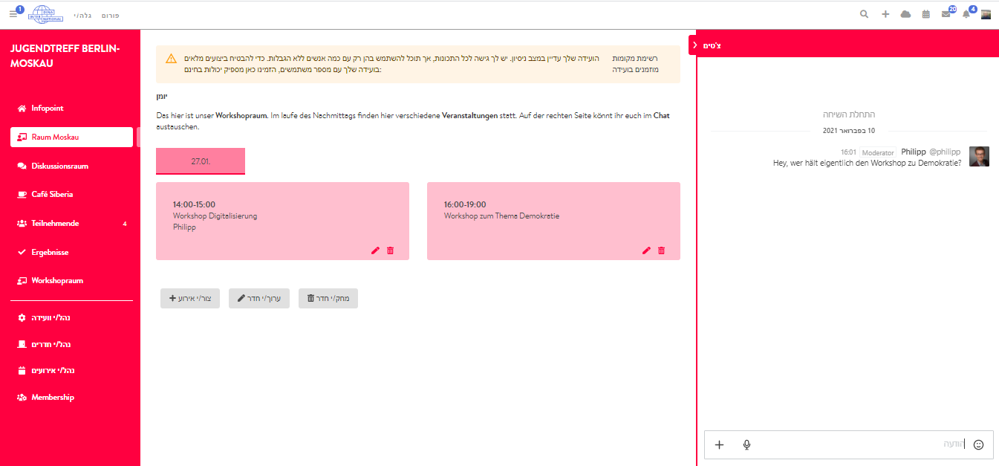

# צ'אט בחדרים

בעת יצירת חדר אירועים, תוכלו לבחור באפשרות **"הצג צ'אט"**, ואז יחובר החדר עם תוכנת הצ'אטים Rocket.Chat המשולבת ב-DINA. תוכנה זו מאפשרת גם צ'אטים בין חברים בפלטפורמת DINA.international. ההבדל בעת השימוש בצ'אט במסגרת מפגש הוא שכל משתתפי המפגש מצורפים אוטומטית לצ'אט הקבוצתי, אם הוא יופעל באותו חדר. הצ'אט הקבוצתי יוצג למשתתפים בצד ימין בחדר הרלוונטי, אם כי אפשרי לגשת אליו גם דרך תפריט ההודעות הרגיל מחוץ למפגש, באמצעות סמל המעטפה למעלה בצד ימין, בסרגל התפריט של DINA.


הצ'אט הקבוצתי של החדר מתאים במיוחד לדיון בשאלות על האירועים הנערכים באותו חדר. כדי ששאלות כאלה אכן ייענו, רצוי שאחראי אחד לפחות יעקוב אחר הצ'אטים.

טיפ: Rocket.Chat קיים כיישומון לנייד וגם למחשבים אישיים \(פי-סי\). להרשמה נחוצים כתובת השרת של DINA \(chat.dina.international\) ונתוני הכניסה שלכם ל-DINA.


