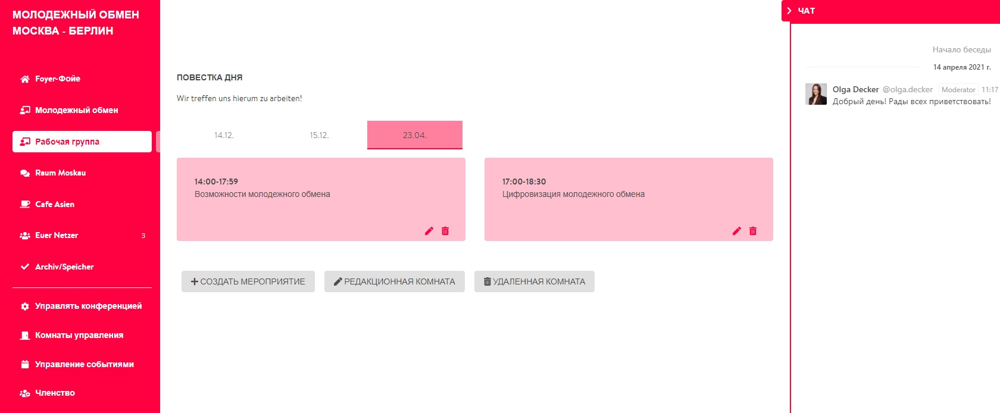

# Чат в помещениях

В процессе создания конференц-помещения ты можешь выбрать опцию **«Показать чат»**. Если ты это сделаешь, помещение подключится к интегрированному в DINA программному обеспечению RocketChat, через которое ты можешь общаться с отдельными членами платформы DINA.international. Разница при его использовании в рамках конференции заключается в том, что все участники конференции – если в помещении включена функция чата – автоматически присоединяются к групповому чату конкретного помещения. Этот групповой чат затем отображается для участников справа в соответствующем помещении, но его также можно открыть через обычное меню сообщений вне конференции \(символ письма в верхнем правом углу в строке меню DINA\).


Групповой чат в конкретном помещении можно использовать для решения вопросов, связанных с проводимыми в этом помещении мероприятиями. Чтобы вопросы не оставались без ответа, рекомендуется назначить как минимум одного ответственного, который будет следить за чатами.

РЕКОМЕНДАЦИЯ: RocketChat также доступен в качестве приложения для мобильных телефонов и персональных компьютеров! Для регистрации требуются адрес сервера DINA \(chat.dina.international\) и твои личные данные доступа DINA.


