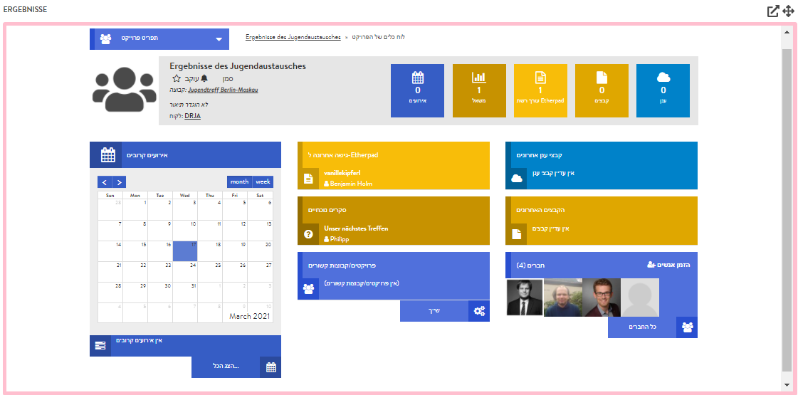

# חדר תוצאות

חדר התוצאות, כמו חדר המשתתפים, למעשה אינו מוגדר חדר, במובן שלא תוכלו למקם בו אירועים. באמצעות חדר התוצאות תוכלו לקשר פרויקט חדש ב-DINA עם המפגש שלכם, ולאפשר גישה אליו לכל המשתתפים. מאחר שחדר זה יוצג בתצוגת החדרים כשאר החדרים האחרים, משתתפים יוכלו לעבוד בו-זמנית על מסמכים, להעלות קבצים לענן, ליצור סקרים או לרשום פריטים ביומן המפגש, ישירות מתוך סביבת המפגש. להלן מודגם מראה של פרויקט מקושר בתוך סביבת המפגש:


אם תרצו להשתמש בחדר התוצאות למפגש שלכם, רצוי שתיצרו אותו לפני שתזמינו משתתפים, שכן אם תצרפו אותם לפני יצירת הקישור – לא תהיה להם גישה לפרויקט המקושר.


