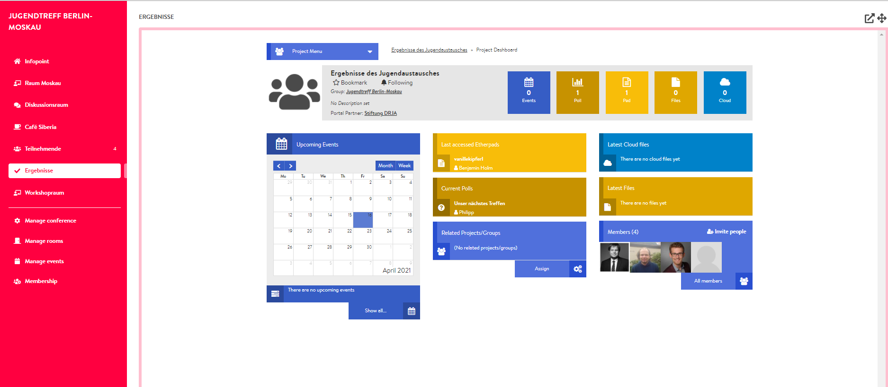

# Results Room

The results room, just like the participants room, is not actually a room at all. This is why you cannot create any events here. You can use the results room to link a \(new\) project on DINA with your conference so that all participants have access to it. Since it is displayed in the conference view like other rooms, participants can work collaboratively on documents, upload files to the cloud, create surveys or fill the project calendar directly from the conference venue. Here is a small example of what an integrated project might look like in the conference venue:


If you want to use a results room for your meeting, you should create it before inviting other participants. Only the members who are added after linking will have access to the linked project.


