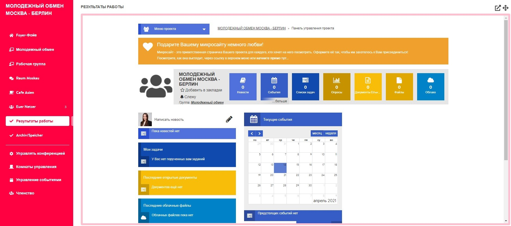

# Помещение результатов

Помещение результатов, как и помещение участников, не является помещением в прямом смысле слова. Поэтому здесь невозможно создавать мероприятия. Через помещение результатов можно связать \(новый\) проект на DINA с твоей конференцией, чтобы все участники имели доступ к нему. Так как это помещение, равно как и другие помещения, отображается в окне просмотра конференции, участники могут совместно работать над документами, загружать файлы в облако, создавать опросы или заполнять календарь проектов непосредственно из окружения конференции. Вот небольшой пример того, как может выглядеть интегрированный проект в окружении конференции:


Если ты хочешь использовать для конференции помещение результатов, тебе необходимо создать его до того, как приглашать дополнительных участников. Доступ к интегрированному проекту получают только те участники, которые будут добавлены после создания ссылки.


