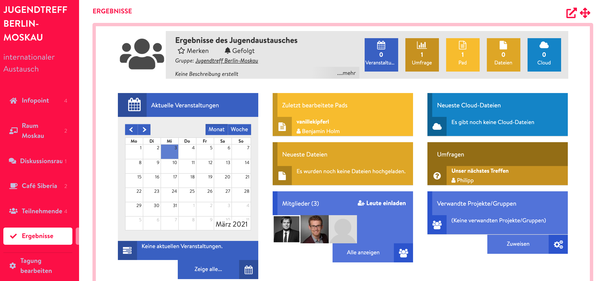

# Ergebnisraum

Der Ergebnisraum ist, genau wie der Teilnehmer-Raum, eigentlich gar kein Raum. Deshalb kannst Du hier entsprechend keine Veranstaltungen anlegen. Über den Ergebnisraum kannst du ein \(neues\) Projekt auf DINA mit deiner Tagung verknüpfen, sodass alle Teilnehmenden darauf Zugriff haben. Da er wie andere Räume in der [Tagungsansicht](../uebersicht/tagungsansicht.md) angezeigt wird, können Teilnehmende direkt aus der Tagungsumgebung heraus kollaborativ an Dokumenten arbeiten, Dateien in die Cloud hochladen, Umfragen anlegen oder den Projektkalender befüllen. Hier ein kleines Beispiel, wie ein eingebundenes Projekt in der Tagungsumgebung aussehen kann:


Falls Du einen Ergebnisraum für deine Tagung verwenden möchtest, dann solltest Du diesen anlegen, bevor du weitere Teilnehmende einlädst. Es erhalten nämlich nur die Mitglieder Zugriff auf das verknüpfte Projekt, die nach der Verknüpfung hinzugefügt werden.


