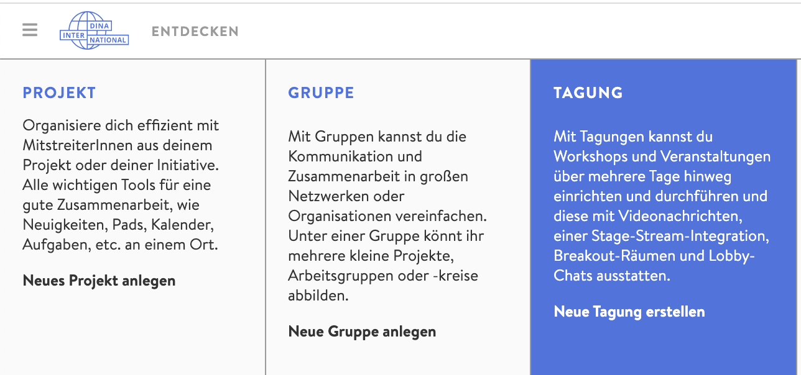

# Vytvoření konference / akce

Chcete vytvořit svou první akci na platformě DINA? V tom případě jste na správném místě! I když na následujících stránkách hovoříme o konferenci, může se samozřejmě jednat také o _výměnu, skupinové setkání, přednáškovou řadu nebo cokoliv dalšího_.

Postup je podobný jako při zakládání skupiny na stránkách DINA. Pokud jste to již dělali, některé věci vám zde budou povědomé.

### Vytvoření nové konference

Začněte kliknutím na symbol „plus“ v horní liště na stránce DINA, pak zvolte dlaždici „Konference“. Tím se dostanete rovnou na stránku, kde si nastavíte všechny důležité parametry konference a kde můžete také rovnou nahrát obsah na [microsite](microsite.md) akce; oboje ale můžete udělat i později.

### Obecná nastavení

#### Název konference

Název konference je povinný údaj, který je v rámci akce viditelný pro všechny účastníky a prostřednictvím microsite i pro kohokoliv zvenčí. Zvolte krátký a příznačný název, který vaši konferenci dobře vystihne.

#### Čas zahájení a ukončení konference

Čas zahájení a ukončení konference se zobrazuje na microsite a je směrodatný pro [e-mailová upozornění](../teilnehmendenmanagement/erinnerungsmails.md), pokud je nastavíte.

#### Způsob přihlašování

Zde můžete nastavit, aby zájemci o akci museli vyplňovat přihlašovací formulář, jehož obsah si můžete sami předem určit. Pokud jej využít nechcete, zvolte možnost bez přihlašovacího formuláře. Konferenci můžete nastavit také tak, že se k ní bude moci bez nahlášení připojit jakýkoliv uživatel platformy. _\(V případě tohoto nastavení se může stát, že se akce zúčastní nečekaně velké množství zájemců. Proto jej doporučujeme jen ve vybraných případech.\)_


V prvních dvou případech budete nové účastníky \(členy\) muset schvalovat. Toto nastavení má tedy vliv na proces přihlašování zájemců o akci.


#### Zobrazení v projektových a skupinových kalendářích \(volitelné\)

Zde můžete uvést, zda konference patří na platformě DINA ke konkrétní skupině nebo je relevantní pro určité skupiny a projekty. Akce se pak zobrazí v kalendáři těchto skupin a projektů _\(např. když na akci hledáte ještě hodně účastníků, můžete ji zveřejnit na DINA fóru, nebo ji podle cílové skupiny propagovat v konkrétních skupinách\)._

#### Popis a informace

Popis události je nezbytný pro její prezentaci navenek, protože je to to první, co případní zájemci na [microsite](microsite.md) uvidí. Proto byste si měli popis dobře rozmyslet a uvést v něm všechny důležité informace o akci. Editor popisu funguje na bázi značkovacího jazyka Markdown. Jeho fungování pochopíte velice rychle a následně s ním můžete rovnou začít pracovat. Informace o něm najdete například [zde](https://cmsstash.de/website-praxis/markdown-fur-webseiten).


Několik základních pravidel značkovacího jazyka Markdown:


#### Kontaktní informace \(volitelné\)

Jak kontaktovat organizátory konference? V tomto poli můžete uvést jak odkazy, tak informace jako adresa, telefonní číslo, sociální sítě atd. Upozorňujeme, že tyto informace budou viditelné i pro kohokoliv zvenčí. Pokud byste některé z nich chtěli zvýraznit, využijte opět Markdown.

#### Barva události \(volitelné\)

Pro svou událost můžete vybrat primární barvu, kterou zadáte v hexadecimálním formátu. Kódy některých barev najdete na [Wikipedii ](https://cs.wikipedia.org/wiki/Wikipedie:Tabulka_barev)nebo zadejte do Googlu „color picker“ a zjistěte si, jak přesně zapsat vaši požadovanou barvu.


Barva události se projeví zejména v [náhledu konference](../uebersicht/tagungsansicht.md), barva správcovského rozhraní se nezmění.


#### Ikona \(volitelné\)

Ikona představuje jakési logo vaší akce, které se zájemcům zobrazí na microsite a ve vyhledávání.

#### Banner \(volitelné\)

Banner se na microsite zobrazí nad názvem skupiny. Proto je vhodné zvolit široký formát, aby nedošlo k oříznutí obrázku \(1140 x 240 pixelů\).

#### Webová stránka \(volitelné\)

Má vaše akce ještě vlastní webovou stránku? Nebo chcete odkázat na stránku, která konferenci propaguje? Zde můžete vložit odkaz, který se zobrazí na microsite.

#### Související témata a klíčová slova \(volitelné\)

Zde můžete uvést, jakých společenských témat se vaše akce týká. Lidé s určitými zájmy tak budou moci událost snadno najít a udělat si představu o jejím obsahu. Pomocí klíčových slov můžete tematickou oblast ještě více zpřesnit. Všechny tyto údaje se zobrazí na microsite.

#### Místo nebo adresa \(volitelné\)

Pokud lze k události přiřadit konkrétní místo \(např. pokud streamujete z Berlína\), můžete ho zde uvést a údaj se zobrazí na microsite.

#### Související projekty / skupiny \(volitelné\)

Chcete odkázat na související projekty nebo spřátelené skupiny, které se věnují stejnému tématu, nebo na své další aktivity? Co zde uvedete, se zobrazí na microsite.

#### Partner v rámci platformy

Váš partner je ta organizace, ke které vaše konference na platformě DINA „přibližně“ spadá. Například pokud vaši akci podporuje konkrétní koordinační centrum nebo pokud se akce týká konkrétní bilaterální spolupráce, tak touto cestou odkážete na její souvislost s daným partnerem.

#### Viditelnost

Zajistěte své události viditelnost pro veřejnost nebo jen pro vybrané skupiny.

Kliknutím na „Uložit“ událost vytvoříte. Pokud chcete, můžete nejdřív upravit [microsite](microsite.md) události – posuňte se nahoru na začátek formuláře a otevřete si záložku microsite. Můžete to ale udělat i dodatečně. Jako další krok byste měli vytvořit konferenční [místnosti](../rooms/).

