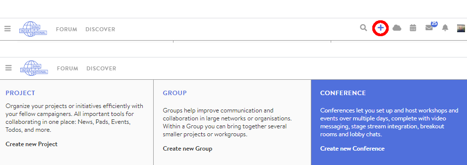

# Creating a Conference / Event

You want to create your first event via DINA? Then you are exactly in the right place! Even though we will be talking about conferences on the next pages, your event can of course also be _an exchange, a group meeting, a convention, a lecture series or something else entirely._

In principle, the process is very similar to creating a group in DINA, so if you have done this before, you will recognise a few things here.

### Creating a new conference

To start the creation process, click on the plus symbol in the top right of the DINA menu bar and then on the Create conference tile. You will now be taken directly to the configuration page where you can make all the basic settings for your event. In addition to the basic settings, you can also fill the microsite of the conference directly from here. However, you can also do this afterwards \(as well as changing the conference settings\).

### General settings

#### Conference name

The conference name is obligatory and is visible to all participants within the conference and to others via the microsite. Think of a short, concise title that best describes your conference.

#### Conference starting and closing time

The starting and closing time of your conference is displayed on the microsite and is the basis for reminder emails, if you have created any.

#### Type of request for participation

Here, you can specify whether people interested in the conference have to fill out an application form which you can design prior to the conference. If you do not wish to have a separate application form, then do not select this field.  
You can also set up the conference so that every portal user can just walk into the conference. _\(As this can lead to unexpectedly large groups that might spontaneously participate in your conference, we recommend only doing this in certain cases\)._


In both cases you have to activate new members. This option mainly changes the application process for interested parties.


#### Display in project or group calendars \(optional\)

If the conference belongs to a group on DINA or is relevant for certain groups or projects, you can indicate this here. The conference will then appear in the calendars of the corresponding groups and projects _\(e.g., you could display a conference for which you are still looking for many participants in a forum on DINA or if the target group has organised itself in a certain group or is to organise itself accordingly\)._

#### Description and info

The description of the conference is essential for external communication, as it is the first thing that interested people will see on the microsite. You should therefore design it with care and provide all the necessary information about your event. The description editor is based on the Markdown markup language which you will use very intuitively, once you got the hang of it. You can find information about it here.


A few basic Markdown rules:


#### Contact details \(optional\)

How can I contact the persons responsible for the conference? In this field, you can enter links as well as information such as address, telephone number, social media, etc. Please note: This information can be read by others. The Markdown syntax also works here, e.g., if you want to highlight something.

#### Conference colour \(optional\)

You can easily specify the primary colour of your conference in hex format. For example, you can find some colours in hex format on Wikipedia. Alternatively, you can simply search Google for "colour picker" and have your chosen colour converted.


The conference colour mainly determines the appearance of the conference view, the admin page will not change.


#### Icon \(optional\)

The icon is a kind of logo for your conference and will be displayed to interested parties on the microsite and in the search.

#### Banner picture \(optional\)

The banner appears on the microsite above the group name. It is therefore best to choose a very wide format so that none of it is cut off \(1140 x 240 pixels\).

#### Website \(optional\)

Does your conference also have its own website or would you like to link to a website announcing your event? Then you can place a link to it here which will be displayed on the microsite.

#### Relevant topics and keywords \(optional\)

Here you indicate which social topics will be relevant during your event so people interested in certain topics can find the conference more easily in the search function and directly see what the event will be about. Keywords can narrow down the subject area even more precisely. Both are displayed on the microsite.

#### Place or address \(optional\)

If a specific location can be assigned to the conference \(e.g., you are streaming from Berlin\), it can be entered here and will appear on the microsite.

#### Related projects/groups \(optional\)

You may want to refer to fellow projects or groups that offer services on the same topic or to yours. These will then be displayed on the microsite.

#### Portal partners

The portal partner is the organisation on DINA your conference "largely" belongs to, e.g., if your conference is supported by a certain coordination office or is part of a bilateral context, you link it to this partner.

#### Visibility

Make your conference visible to the general public or only to certain groups of people.

Click on "Save" to create the event. If you wish, you can also create a microsite for the conference by scrolling up to the top of the form and clicking on the Microsite tab. However, you can also do this later! Next, you should create rooms for the conference.

