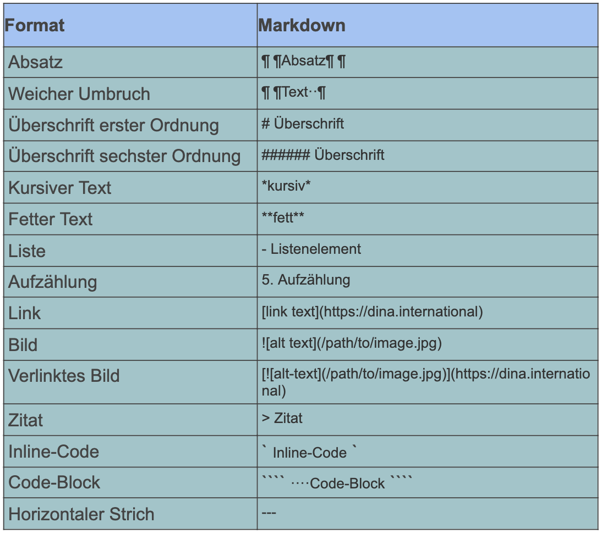

# Создать конференцию / мероприятие

Ты хочешь создать свое первое мероприятие с помощью платформы DINA? Тогда ты попал туда, куда надо! Даже если мы на следующих страницах будем говорить о конференции, твое мероприятие, конечно, может быть _обменом, групповой встречей, конференцией, циклом лекций или чем-то совершенно другим._

В принципе этот процесс очень похож на создание группы на платформе DINA. Если ты это уже делал, то некоторые моменты покажутся тебе знакомыми.

### Создать новую конференцию

Чтобы начать процесс создания конференции, кликни на символ плюса в правом верхнем углу панели меню DINA, выбери плитку "Конференция" и кликни на "Создать событие". Теперь ты будешь перенаправлен на страницу конфигурации, где ты можешь выполнить все основные настройки для твоего мероприятия. В дополнение к базовым настройкам отсюда можно напрямую заполнить [микросайт](https://app.gitbook.com/@dina-international/s/manual/~/drafts/-MY9DMMC5Y2UhbHjLBgJ/v/rus/funktionalitaeten/start/microsite) конференции, но это также возможно будет сделать и позднее \(так же как и редактирование настроек конференции\).

### Общие настройки

#### Название конференции

Заполнение названия конференции является обязательным, название видно всем участникам конференции и внешним пользователям через микросайт. Придумайте короткое и лаконичное название, которое как можно лучше опишет твою конференцию.

#### Время начала и окончания конференции

Время начала и окончания твоей конференции будет отображаться на микросайте и является основой для отправки напоминаний по электронной почте, если ты создал эту возможность.

#### Тип заявки на участие в конференции

Здесь ты можешь определить, необходимо ли лицам, заинтересовавшимся в твоей конференции, заполнять заявку на участие. Форму заявки ты можешь предварительно подготовить. Если ты считаешь, что заявка не нужна, то тогда не выбирай это поле.

Кроме того, ты можешь настроить конференцию таким образом, чтобы любой пользователь портала мог просто присоединиться к конференции. _\(Так как в результате этого неожиданно могут возникать большие группы, которые спонтанно желают принять участие в твоей конференции, мы рекомендуем делать это только в определенных случаях\)._


В обоих случаях ты должен активировать новых участников. Эта опция в основном меняет процесс подачи заявки для тех, кто заинтересован в подключении к конференции. 


#### Отображения в календарях проекта или группах \(необязательно\)

Если конференция принадлежит к группе на платформе DINA или имеет отношение к определенным группам или проектам, ты можешь указать это здесь. Конференция будет отображаться в календарях соответствующих групп и проектов _\(например, возможен вариант, что ты выкладываешь конференцию, для которой ты пока еще ищешь участников, в форуме на DINA, или, например, если целевая группа организовалась или должна организоваться в определенной группе\)._

#### Описание и информация

Описание конференции очень важно для внешней презентации, потому что это первое, что увидят заинтересованные лица на [микросайте](https://app.gitbook.com/@dina-international/s/manual/~/drafts/-MY9DMMC5Y2UhbHjLBgJ/v/rus/funktionalitaeten/start/microsite). Поэтому тебе следует тщательного его оформить и предоставить всю необходимую о твоем мероприятии. Редактор описаний основан на языке разметки Markdown, которым ты будешь пользоваться очень интуитивно, как только ты попробуешь его использовать один раз, и поймешь, как с ним работать. Соответствующую информацию можно найти, например, здесь.


Несколько основных правил Markdown:


#### Контактная информация \(необязательно\)

Как можно связаться с ответственными за конференцию лицами? В этом поле можно внести ссылки, а также другую информацию, например, адрес, номер телефона, социальные сети и т. д. Внимание: эту информацию смогут читать посторонние лица. И в этом случае ты можешь использовать синтаксис Markdown, если тебе необходимо что-то особо выделить.

#### Цвет конференции \(необязательно\)

Ты можешь легко задать основной цвет твоей конференции в формате HTML. Например, ряд цветов в формате HTML можно найти на [Википедии](https://ru.wikipedia.org/wiki/%D0%A6%D0%B2%D0%B5%D1%82%D0%B0_HTML); или ты можешь просо выполнить поиск в Google по запросу «цвета html коды» и преобразовать нужный цвет.


Цвет конференции в основном определяет внешний вид конференции, страница администратора не изменяется.


#### Иконка \(необязательно\)

Иконка является, так сказать, логотипом твоей конференции и будет отображаться на микросайте и в поиске.

#### Изображение баннера \(необязательно\)

Баннер отображается на микросайте над названием группы. Поэтому рекомендуется выбрать широкий формат, чтобы  изображение не обрезалось \(1140 x 240 пикселей\).

#### Веб-сайт \(необязательно\)

Возможно, у твоей конференции дополнительно есть собственный веб-сайт или, может быть, ты хочешь выложить ссылку на веб-сайт, где размещено объявление об этом мероприятии? Тогда ты можешь здесь разместить соответствующую ссылку, которая будет отображаться на микросайте.

#### Важные темы и ключевые слова \(необязательно\)

Здесь ты указываешь, какие общественные темы играют важную роль на твоем мероприятии, чтобы люди, интересующиеся определенными темами, могли проще найти конференцию в поиске и получить представление о ее содержании. С помощью ключевых слов можно сузить соответствующую тему. И темы, и ключевые слова отображаются на микросайте.

#### Место проведения конференции или адрес \(необязательно\)

Если конференцию можно соотнести с определенным местом \(например, ты ведешь трансляцию из Берлина\), то тогда это место можно указать здесь, а затем оно будет отображено на микросайте.

#### Смежные проекты/группы \(необязательно\)

Может быть, ты хочешь указать на дружественные проекты или группы, которые работают по аналогичной тематике, или же на свои собственные проекты и группы. Соответствующая информация будет отображаться на микросайте.

#### Партнер портала

Партнером портала является та организация на портале DINA, к которой «примерно» принадлежит твоя конференция, например, если конференция поддерживается определенным координационным бюро или, например, если она находится в определенном двустороннем контексте, то тогда ты указываешь на связь с этим партнером.

#### Видимость

Обеспечь видимость твоей конференции для общественности или только для определенных групп людей.

Теперь кликнув на значок «Сохранить» вы создадите конференцию. При желании до этого можно создать микросайт для конференции, прокрутив до верхней части формы и нажав на вкладку [Микросайт](https://app.gitbook.com/@dina-international/s/manual/~/drafts/-MY9DMMC5Y2UhbHjLBgJ/v/rus/funktionalitaeten/start/microsite). Но это также можно сделать и в последующем! В качестве следующего шага необходимо создать [помещения для конференции](https://app.gitbook.com/@dina-international/s/manual/~/drafts/-MY9DMMC5Y2UhbHjLBgJ/v/rus/funktionalitaeten/rooms).

