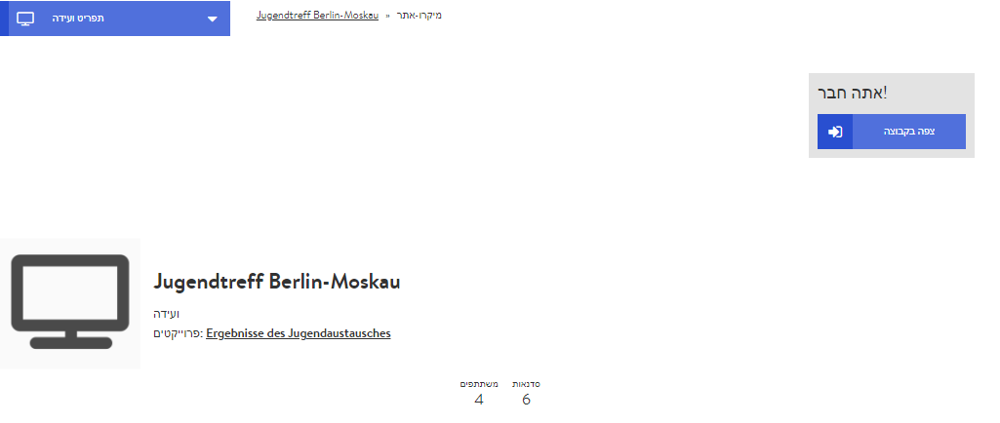

# מיקרו-אתר

המיקרו-אתר מייצג את המפגש שלכם כלפי חוץ, והוא נגיש לכל מי שברשותו קישור למפגש. זהו מעין כרטיס ביקור דיגיטלי שלכם. לכן, כדאי שיהיה בעיקר בעל אופי אינפורמטיבי ושייצור עניין במפגש / באירוע. כמו כן יוכלו המתעניינים להירשם למפגש באמצעות המיקרו-אתר, וכך גם תוכלו לנהל את המשתתפים שלכם.

### עריכת המיקרו-אתר 

הגדרות המיקרו-אתר הן חלק מהגדרות המפגש הכלליות. לפיכך, ייתכן שכבר עיצבתם את המיקרו-אתר בעת יצירת המפגש. עם זאת, באפשרותכם לעצב אותו גם בדיעבד, בכל עת. לעריכת המיקרו-אתר בחרו בלשונית "הגדרות" בדף האדמין.


רבות מההגדרות שם הן כלליות, ואין להן השפעה על מראה המיקרו-אתר. המרכיבים המרכזיים המשפיעים על המראה הם הצלמית, תמונת הבאנר, התיאור והמידע להתקשרות.


