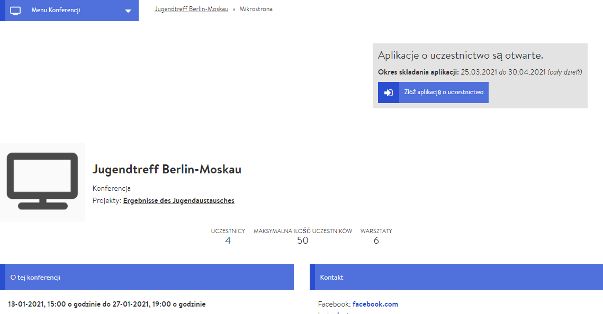

# Microsite

Die Microsite ist die Repräsentation Deiner Tagung nach außen und kann von jede\*r mit dem Link zur Tagung aufgerufen werden - sie ist sozusagen Dein großes digitales Aushängeschild. Deshalb sollte sie vor allem informativen Charakter besitzen und das Interesse an der Tagung/Veranstaltung schüren. Außerdem können Interessierte sich über die Microsite bei der Tagung anmelden, wodurch sie gleichzeitig Teil Deines [Teilnehmendenmanagements](../teilnehmendenmanagement/) ist. 

### Bearbeiten der Microsite 

Die Einstellungen für die Microsite sind Teil der allgemeinen Tagungseinstellungen. Deshalb hast Du die Microsite möglicherweise bereits beim [Anlegen der Tagung](./) gestaltet, allerdings kannst Du sie auch jederzeit im Nachhinein bearbeiten. Zum Bearbeiten der Microsite gelangst Du über die Admin Seite, indem Du dort auf den Reiter Einstellungen klickst.


Manche der Einstellungen hier sind genereller Natur und haben keinen Einfluss auf das Erscheinungsbild der Microsite. Am wichtigsten dafür sind das Icon, das Bannerbild, die Beschreibung und die Kontaktinformationen.


