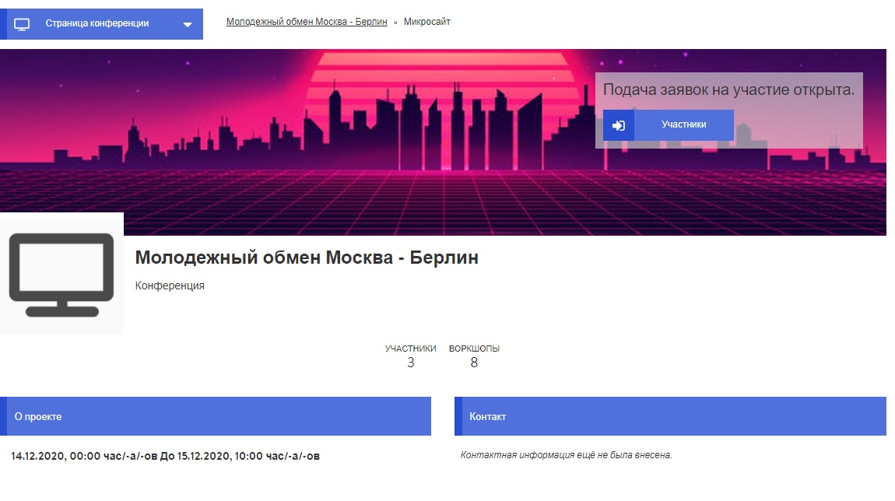

# Микросайт

Микросайт – это внешняя презентация твоей конференции.  Он доступен любому через ссылку на конференцию, и является, так сказать, твоей большой цифровой вывеской. Поэтому он должен носить прежде всего информационный характер и стимулировать интерес к конференции/мероприятию. Кроме того, заинтересованные лица могут зарегистрироваться на конференцию через микросайт, в результате чего он также является элементом [управления участниками](https://app.gitbook.com/@dina-international/s/manual/~/drafts/-MY9DMMC5Y2UhbHjLBgJ/v/rus/funktionalitaeten/teilnehmendenmanagement).

### Редактирование микросайта

Настройки для микросайта являются элементом общих настроек конференции. Поэтому может быть, ты уже оформил микросайт при [создании конференции](https://app.gitbook.com/@dina-international/s/manual/~/drafts/-MY9DMMC5Y2UhbHjLBgJ/v/rus/funktionalitaeten/start), но ты также можешь редактировать его в любое время. Для редактирования микросайта ты заходишь через страницу администратора, кликнув там на вкладку «Настройки».


Ряд настроек носит общий характер, они не влияют на внешний вид микросайта. Самыми важными являются иконка, изображение баннера, описание и контактная информация.


