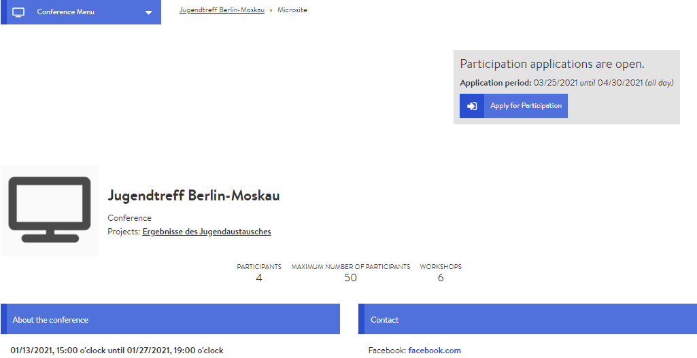

# Microsite

The microsite is the external representation of your conference and can be accessed by anyone with a link to the conference - it is, as it were, your big digital signboard. It should therefore have an informative character and generate interest in the conference/event. In addition, interested people can register for the conference via the microsite which is also part of your participant management.

### Editing the microsite

The settings for the microsite are part of the general conference settings. You may have already designed the microsite when you created the conference, however, you can also edit it anytime afterwards. You can edit the microsite via the Admin page by clicking on the Settings tab.


Some of the settings here are of a general nature and have no influence on the look and feel of the microsite. The most relevant settings are the icon, the banner image, the description and the contact information.


