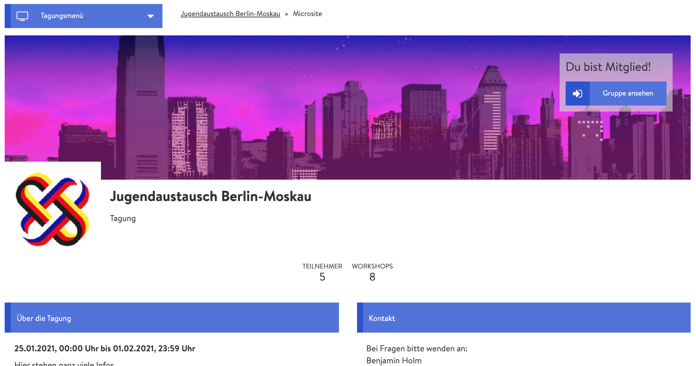

# Microsite

Microsite prezentuje vaši událost navenek a přes odkaz akce se na ni dostane kdokoliv. Je tedy vaším elektronickým vývěsním štítem, a proto by měla obsahovat všechny podstatné informace a vzbuzovat zájemu. Zájemci se navíc jejím prostřednictvím mohou na akci přihlašovat, takže je součástí vaší [správy účastníků](../teilnehmendenmanagement/). 

### Úpravy microsite

Nastavení microsite je součástí obecných nastavení události. Proto je možné, že jste microsite možná už vytvořili při [vytvoření konference](./). Upravit ji můžete ale také kdykoliv později. Ve správcovském náhledu klikněte na záložku nastavení.


Velká část nastavení je zde obecné povahy a nemá vliv na vzhled microsite. Pro ten je nejdůležitější ikona, obrázek na banneru, popis a kontaktní informace.


