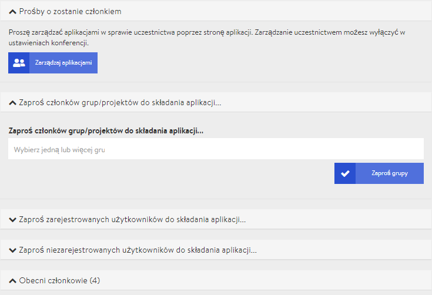

# Teilnehmendenmanagement

Was wäre eine Veranstaltung, Tagung, Treffen, oder Konferenz ohne eine engagierte Community aus Interessierten, Teilnehmenden, Schüler\*innen oder Mitgliedern? Zur Vorbereitung einer virtuellen Tagung gehört deshalb auch das Verwalten und Hinzufügen von Teilnehmenden, die wir auf unserer Plattform Mitglieder nennen. 

Zu einer virtuellen Tagung auf DINA kannst Du sowohl bereits registrierte Nutzer\*innen der Plattform hinzufügen, als auch externe Teilnehmende mit ihren E-Mail Adressen einladen. Über die Microsite der Tagung lässt sich zudem ein einfaches Formular freischalten, über das sich interessierte Menschen selbst anmelden können. 

Zunächst möchten wir Dir aber einen Überblick über die verschiedenen Rollen auf einer virtuellen Tagung geben. Jede Rolle ist mit bestimmten Rechten verbunden, die ihr verschiedene Möglichkeiten der Interaktion mit der Plattform oder innerhalb von Videokonferenzen geben.

### Rollen



Administrator\*innen - oder kurz: Admins - haben Zugriff auf sämtliche [Einstellungen](../admin-page.md) der Tagung. Sie können das Erscheinungsbild der Tagung verändern, Räume und Veranstaltungen erstellen, bearbeiten und löschen, Teilnehmende verwalten und haben in allen Videokonferenzen erweiterte Moderator\*innen Rechte. 


Die Anzahl der Administrator\*innen sollte im Idealfall auf wenige Personen begrenzt sein, um ungewollte Änderungen zu verhindern.




Präsentierende können von Admins beim Erstellen oder Bearbeiten einer spezifischen Veranstaltung benannt werden. Sie besitzen daraufhin erweiterte Moderator\*innen Rechte in der Videokonferenz der gewählten Veranstaltung. In allen anderen Räumen und Veranstaltungen haben sie nur die normalen Teilnehmenden Rechte.


Falls eine Person bei mehreren Veranstaltungen Moderationsrechte erhalten soll, dann musst Du sie bei jeder Veranstaltung als Präsentierende\*n einstellen.




Teilnehmende haben keinerlei Bearbeitungsrechte. Sie können alle \(eingeblendeten\) Räume betreten und an den darin stattfindenden Veranstaltungen teilnehmen. Jede Person, die einer Tagung hinzugefügt wird, beginnt mit Teilnehmenden Rechten. Admins können Teilnehmende zu Administratoren befördern oder in ausgewählten Veranstaltungen zu Präsentierenden berufen.



Dolmetschende unterstützen die Tagung durch Simultandolmetschen. Da Sie Zugriff auf die Technik brauchen, müssen sie in der Tagung als Administratoren benannt werden.



### Teilnehmende einladen

Um das Teilnehmendenmanagement aufzurufen navigiere bitte zunächst von der Admin Seite zum Reiter "**Mitglieder**".

Es gibt mehrere Methoden, Personen zu einer Tagung einzuladen. Wir unterscheiden hier vor allem, ob:

* jemand bereits auf der Plattform angemeldet ist oder
* als Externe\*r an einer Tagung teilnehmen will

In letztem Fall ist es einerseits möglich, im Zuge der Anmeldung einen DINA Account anlegen zu lassen oder - daran arbeiten wir noch - ausschließlich einen temporären Zugang im Rahmen einer Tagung zu vergeben.


 Je nachdem, ob Du das [Antragsformular](antragsformular.md) für Teilnehmende in den Tagungseinstellungen ein oder ausgeschaltet hast, heißen die im Folgenden beschriebenen Optionen anders. Wir beschreiben hier die Situation bei ausgeschaltetem Antragsformular.


#### Einladen von Plattform Nutzer\*innen

Das Einladen von Personen, die bereits auf DINA aktiv sind, ist besonders einfach. Sofern Du dich bereits im Teilnehmendenmanagement befindest, siehst Du hier die Option "Registrierte Benutzer\*innen einladen..." mit einer Zahl in Klammern. Diese Zahl sagt aus, wie viele Plattformbenutzer\*innen bereits eingeladen wurden und ihre Einladung noch nicht angenommen haben. In das Eingabefeld kannst Du nun einfach den Anfang eines Namens eintippen und erhältst bereits Vorschläge. So lassen sich nach und nach Nutzer\*innen hinzufügen. Die Eingabe musst Du schließlich noch über den Button "Benutzer\*innen einladen" bestätigen.


Kleiner Tipp: Sobald Dir der richtige Name an erster Stelle angezeigt wirst, kannst Du Enter drücken und direkt den nächsten Namen eingeben. So lassen sich mehrere Personen schnell nacheinander eingeben und gleichzeitig einladen.


#### Einladen von externen Nutzer\*innen \(mit Registrierung bei DINA\)

Über die Option "Nicht registrierte Benutzer\*innen einladen" kannst Du externe Teilnehmende einladen, die sich bei Annahme der Einladung direkt einen DINA Account anlegen sollen. Die Zahl in Klammern sagt aus, wie viele Externe bereits eingeladen wurden und sich noch nicht bei DINA registriert haben. Klicke nun auf den Button "Leute einladen". 

In der folgenden Ansicht kannst Du eine oder mehrere E-Mail Adressen in das entsprechende Feld einfügen. Mehrere trennst Du einfach mit einem Komma oder verwendest jeweils eine eigene Zeile. Füge der Einladungsmail optional noch eine persönliche Nachricht hinzu. Nachdem Du mit dem Button "Einladen" bestätigt hast, bekommen alle eingeladenen Personen eine E-Mail mit einem Link, um sich bei DINA zu registrieren. Nach der Registrierung werden sie direkt der Tagung als Teilnehmende hinzugefügt.

#### Einladung von externen Nutzer\*innen \(ohne DINA Registrierung\)

_Diese Option ist noch nicht implementiert._

### Mitgliedsanträge verwalten

Haben Interessierte einen "Mitgliedsantrag" bzw. synonym einen Aufnahmeantrag über die Microsite der Tagung gestellt, dann erscheinen sie unter dem Reiter "**Mitglieder Anträge**". Hier können sie von eine\*r Tagungsadministrator\*in angenommen oder abgelehnt werden. Nach der Entscheidung erhalten alle Personen eine Benachrichtigung über die Glocke oben rechts der DINA Plattform und - bei entsprechenden Benachrichtigungseinstellungen - auch per Email. Angenommene Teilnehmende können jetzt die Tagung betreten.

### Aktuelle Mitglieder verwalten

Unter dem Reiter "**Aktuelle Mitglieder**" werden Dir alle bereits angenommenen Teilnehmenden der Tagung angezeigt. Neben dem Namen auf der linken Seite findet sich rechts ein E-Mail Symbol, welches einen \(Rocket-\)Chat mit der betreffenden Person über die DINA Plattform eröffnet. Neben dem E-Mail Symbol steht die Rolle, diese kann entweder Admin oder Mitglied lauten. 

Öffnest Du das Aufklappmenü einer Person, dann hast du drei Optionen:

* **Einen anstößigen Inhalt melden**: Hat sich jemand gegen die Regeln von DINA verhalten, dann kannst Du ihn/sie uns melden. Wir ergreifen dann angemessene Maßnahmen.
* **Rolle ändern**: Mit "Als Mitglied" oder "Als Admin" änderst Du die Rolle der Person zum Mitglied oder Admin der Tagung.
* **Entfernen**: Entfernt die Person aus der Tagung. Sie kann dann nicht mehr teilnehmen, solange sie keinen neuen Aufnahmeantrag stellt.

