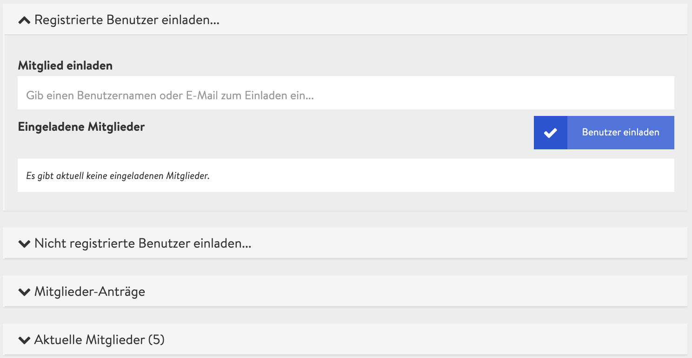

# Διαχείριση συμμετεχόντων

Τι θα ήταν μια εκδήλωση, συνάντηση, συγκέντρωση ή ένα συνέδριο χωρίς μια κινητοποιημένη κοινότητα ενδιαφερομένων, συμμετεχόντων, μαθητών ή μελών; Η προετοιμασία ενός ψηφιακού συνεδρίου περιλαμβάνει και τη διαχείριση και προσθήκη συμμετεχόντων, οι οποίοι ονομάζονται μέλη, εντός της πλατφόρμας μας.

Μπορείτε να προσθέσετε εγγεγραμμένους χρήστες της πλατφόρμας σε κάποιο ψηφιακό συνέδριο στην πλατφόρμα DINA καθώς και να προσκαλέσετε εξωτερικούς συμμετέχοντες με τις διευθύνσεις e-mail τους. Επιπλέον, μπορείτε να ενεργοποιήσετε ένα απλό έντυπο στον μικρότοπο του συνεδρίου, για να δώσετε στους ενδιαφερόμενους τη δυνατότητα να εγγραφούν μόνοι τους.

Ωστόσο, θα θέλαμε αρχικά να σας παρουσιάσουμε μια επισκόπηση σχετικά με τους διαφορετικούς ρόλους που υπάρχουν σε ένα ψηφιακό συνέδριο. Κάθε ρόλος σχετίζεται με συγκεκριμένα δικαιώματα, τα οποία παρέχουν διαφορετικές δυνατότητες διάδρασης με την πλατφόρμα ή εντός των τηλεδιασκέψεων.

**Ρόλοι**



Οι διαχειριστές διαθέτουν πρόσβαση σε όλες τις [ρυθμίσεις](https://app.gitbook.com/@dina-international/s/manual/v/gre/funktionalitaeten/admin-page) του συνεδρίου. Μπορούν να τροποποιήσουν την οπτική εικόνα εμφάνισης του συνεδρίου, να δημιουργήσουν, να επεξεργαστούν ή να διαγράψουν αίθουσες και εκδηλώσεις, να διαχειριστούν τους συμμετέχοντες, ενώ παράλληλα διαθέτουν και διευρυμένα δικαιώματα συντονισμού σε όλες τις τηλεδιασκέψεις.


Ιδανικά, ο αριθμός των διαχειριστών θα πρέπει να περιορίζεται σε μικρό αριθμό ατόμων προς αποφυγή ανεπιθύμητων αλλαγών.




Οι διαχειριστές ορίζουν τους παρουσιαστές κατά τη δημιουργία ή την επεξεργασία μιας συγκεκριμένης εκδήλωσης. Τότε, αποκτούν διευρυμένα δικαιώματα συντονισμού στην τηλεδιάσκεψη της επιλεγμένης εκδήλωσης. Σε όλες τις υπόλοιπες αιθουσες και εκδηλώσεις διαθέτουν μόνο κανονικά δικαιώματα συμμετοχής.


Εάν κάποιο άτομο αποκτήσει δικαιώματα συντονισμού σε περισσότερες εκδηλώσεις, θα πρέπει να τον/την ορίσετε παρουσιαστή/παρουσιάστρια σε κάθε εκδήλωση.




Οι συμμετέχοντες δεν διαθέτουν δικαιώματα επεξεργασίας. Μπορούν να εισέλθουν σε όλες τις αίθουσες \(όπως φαίνεται\) και να συμμετάσχουν στις εκδηλώσεις, που πραγματοποιούνται εκεί. Κάθε άτομο, που προστίθεται σε κάποια συνεδρία, ξεκινά με δικαιώματα συμμετοχής. Οι διαχειριστές μπορούν να αναβαθμίσουν τους συμμετέχοντες σε διαχειριστές ή να τους ορίσουν ως παρουσιαστές σε επιλεγμένες εκδηλώσεις.



Οι διερμηνείς υποστηρίζουν το συνέδριο με ταυτόχρονη διερμηνεία. Καθώς χρειάζονται πρόσβαση στην τεχνολογία, θα πρέπει να οριστούν διαχειριστές του συνεδρίου.



**Πρόσκληση συμμετεχόντων**

Για να αποκτήσετε πρόσβαση στη διαχείριση των συμμετεχόντων, περιηγηθείτε αρχικά από τη σελίδα διαχείρισης στην καρτέλα **«Μέλη».**

Υπάρχουν αρκετοί τρόποι για να προσκαλέσετε κάποιον σε μια συνάντηση. Κατά κύριο λόγο, διακρίνονται σε δύο: 

• Κάποιος είναι ήδη εγγεγραμμένος στην πλατφόρμα ή 

• Επιθυμεί να συμμετάσχει σε κάποιο συνέδριο ως εξωτερικός συμμετέχων.

Στην τελευταία περίπτωση, μπορείτε από τη μία να δημιουργήσετε έναν λογαριασμό στην πλατφόρμα DINA κατά τη διάρκεια της εγγραφής, ή – αυτή η επιλογή δεν είναι ακόμη διαθέσιμη – να χορηγήσετε μόνο προσωρινή πρόσβαση στο περιεχόμενο κάποιου συνεδρίου.


 Ανάλογα με το αν έχετε ενεργοποιήσει ή απενεργοποιήσει το [έντυπο αίτησης](https://app.gitbook.com/@dina-international/s/manual/v/gre/funktionalitaeten/teilnehmendenmanagement/antragsformular) για τους συμμετέχοντες στις ρυθμίσεις του συνεδρίου, οι ακόλουθες επιλογές θα έχουν διαφορετικά ονόματα. Εδώ, περιγράφουμε την περίπτωση απενεργοποίησης του εντύπου αίτησης.


**Πρόσκληση των χρηστών της πλατφόρμας**

Η πρόσκληση των ατόμων, που είναι ήδη ενεργά στην πλατφόρμα DINA, είναι πολύ εύκολη. Εάν βρίσκεστε ήδη στη διαχείριση συμμετεχόντων, θα δείτε την επιλογή «Πρόσκληση εγγεγραμμένων χρηστών…» με έναν αριθμό σε παρενθέσεις. Αυτός ο αριθμός δείχνει τον αριθμό των χρηστών της πλατφόρμας που έχουν προσκληθεί ήδη και δεν έχουν αποδεχθεί ακόμη την πρόσκληση. Εδώ, μπορείτε να πληκτρολογήσετε την αρχή ενός ονόματος στο πεδίο εισαγωγής και θα εμφανιστούν αμέσως τα προτεινόμενα ονόματα. Αυτό σας επιτρέπει να προσθέσετε σταδιακά χρήστες. Τέλος, πρέπει να επιβεβαιώσετε την καταχώρισή σας, κάνοντας κλικ στο πλήκτρο «Πρόσκληση χρηστών».


Μικρή υπόδειξη: Μόλις εμφανιστεί το σωστό όνομα στην πρώτη θέση, μπορείτε να πιέσετε Enter και να εισάγετε απευθείας το επόμενο όνομα. Αυτό σας δίνει τη δυνατότητα να εισάγετε γρήγορα και να προσκαλέσετε ταυτόχρονα πολλά άτομα το ένα μετά το άλλο.


**Πρόσκληση εξωτερικών χρηστών \(με εγγραφή στην πλατφόρμα DINA\)**

Μπορείτε να χρησιμοποιήσετε την επιλογή «Πρόσκληση μη εγγεγραμμένων χρηστών», για να προσκαλέσετε εξωτερικούς χρήστες, οι οποίοι θα πρέπει να δημιουργήσουν έναν λογαριασμό στην πλατφόρμα DINA αμέσως μόλις αποδεχθούν την πρόσκληση. Ο αριθμός εντός των παρενθέσεων υποδεικνύει τον αριθμό των εξωτερικών συμμετεχόντων που έχουν ήδη προσκληθεί και δεν έχουν εγγραφεί ακόμη στην πλατφόρμα DINA. Τώρα, κάντε κλικ στο πλήκτρο «Πρόσκληση ατόμων».

Στην ακόλουθη επισκόπηση μπορείτε να εισάγετε μία ή περισσότερες διευθύνσεις e-mail στο αντίστοιχο πεδίο. Διαχωρίστε τις διευθύνσεις με κόμμα ή χρησιμοποιήστε διαφορετική σειρά για την κάθε μια. Εάν το επιθυμείτε, μπορείτε να προσθέσετε κάποιο προσωπικό μήνυμα στο e-mail-πρόσκληση. Αφού επιβεβαιώσετε πατώντας το πλήκτρο «Πρόσκληση», όλοι οι προσκεκλημένοι θα λάβουν ένα e-mail με έναν σύνδεσμο, για να εγγραφούν στην πλατφόρμα DINA. Μετά την εγγραφή, θα προστεθούν αυτόματα στο συνέδριο ως συμμετέχοντες.

**Πρόσκληση εξωτερικών χρηστών \(χωρίς εγγραφή στην πλατφόρμα DINA\)**

_Προς το παρόν, η εν λόγω επιλογή δεν είναι διαθέσιμη._

**Διαχείριση αιτήσεων μελών**

Εάν κάποιος ενδιαφερόμενος έχει καταθέσει «αίτηση συμμετοχής» ή, αλλιώς, αίτηση εγγραφής μέσω του μικρότοπου του συνεδρίου, αυτή θα εμφανιστεί στην καρτέλα **«Αιτήσεις μελών»**. Οι διαχειριστές του συνεδρίου μπορούν να αποδεχτούν ή να απορρίψουν τις αιτήσεις. Αφού αποφασίσουν, όλοι οι ενδιαφερόμενοι θα λάβουν μια ειδοποίηση στο πάνω δεξί τμήμα της πλατφόρμας DINA, μέσω του εικονιδίου «Κουδούνι», καθώς και μέσω e-mail, με τις κατάλληλες ρυθμίσεις ειδοποίησης. Οι συμμετέχοντες, που έγιναν αποδεκτοί, μπορούν να εισέλθουν τώρα στο συνέδριο.

**Διαχείριση τρεχόντων μελών**

Η καρτέλα **«Τρέχοντα μέλη»** δείχνει όλους τους συμμετέχοντες του συνεδρίου, που έχουν γίνει ήδη δεκτοί. Δίπλα στο όνομα στην αριστερή πλευρά, θα βρείτε στα δεξιά το σύμβολο του e-mail, το οποίο ανοίγει μια ζωντανή συνομιλία \(Rocket\) με το εν λόγω άτομο μέσω της πλατφόρμας DINA. Δίπλα στο εικονίδιο του e-mail, θα δείτε τον ρόλο, που μπορεί να είναι είτε Διαχειριστής είτε Μέλος.

Εάν ανοίξετε το αναπτυσσόμενο μενού ενός ατόμου, έχετε τρεις επιλογές: 

**• Αναφορά ανάρμοστου περιεχομένου:** Εάν η συμπεριφορά κάποιου/κάποιας αντιτίθεται στους κανονισμούς της DINA, μπορείτε να τον/την αναφέρετε σε εμάς. Εμείς, στη συνέχεια, θα λάβουμε τα κατάλληλα μέτρα. 

**• Αλλαγή ρόλου:** Με το πλήκτρο «Ως Μέλος» ή «Ως Διαχειριστής» μπορείτε να αλλάξετε τον ρόλο κάποιου ατόμου σε μέλος ή σε διαχειριστή του συνεδρίου. 

**• Αφαίρεση:** Αφαιρεί κάποιο άτομο από το συνέδριο. Τα εν λόγω άτομα δεν θα είναι σε θέση να συμμετάσχουν μέχρι να καταθέσουν εκ νέου αίτηση συμμετοχής

