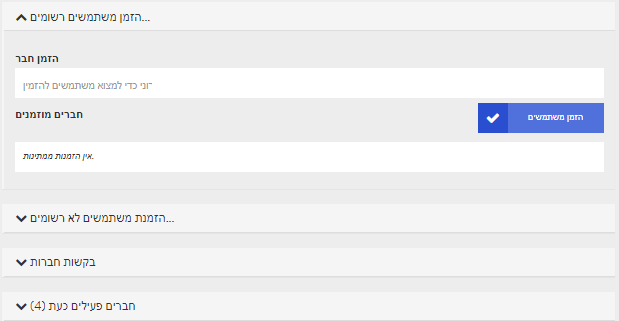

# ניהול משתתפים

קהילה של מעוניינים, משתתפים, תלמידים או חברים בעלי מוטיבציה הם חלק בלתי נפרד מכל אירוע, מפגש, התכנסות או ועידה. לכן, כדי להכין מפגש וירטואלי צריך גם לנהל ולהוסיף משתתפים. בפלטפורמת DINA הם מכונים "חברים".

למפגש וירטואלי ב-DINA תוכלו אפוא להוסיף משתמשים בפלטפורמה שכבר נרשמו, אבל גם להזמין משתתפים "מבחוץ" באמצעות כתובת המייל שלהם. נוסף כל כך, תוכלו להפיץ במיקרו-אתר טופס רישום עצמי למפגש שבאמצעותו יוכלו מעוניינים להירשם.

אך תחילה, נסקור את שלל בעלי התפקידים במפגש הווירטואלי. כל אחד מהתפקידים כרוך בהרשאות מסוימות המאפשרות לו מגוון דרכים ליחסי גומלין עם הפלטפורמה או בתוך ועידות הווידיאו.

### תפקידים



למנהלי מערכת – או בכינוי המקוצר "אדמינים" – גישה לכל הגדרות המפגש. הם יכולים לשנות את מראה המפגש, ליצור, לערוך ולמחוק חדרים ואירועים וכן לנהל משתתפים. כמו כן, הם בעלי הרשאות מנחים מורחבות בכל ועידות הווידיאו. 


רצוי לשמור על מספר מצומצם של אדמינים כדי למנוע שינויים בלתי רצויים מצדם של בעלי הרשאת אדמין.




אדמינים יכולים למנות מגישים בעת יצירה או עריכה של אירוע ספציפי. למגישים אלה יהיו הרשאות מנחים מורחבות שיהיו תקפות רק בוועידת הווידיאו באירוע הנבחר. בכל החדרים והאירועים האחרים ההרשאות שלהם יהיו כשל שאר המשתתפים מן המניין.


אם יהיה עליכם לתת למנחה הרשאות הנחיה ביותר מאשר באירוע אחד, יהיה עליכם למנותו בכל אירוע כמגיש.




למשתתפים אין הרשאות עריכה כלל. הם רשאים להיכנס לכל אחד מהחדרים ברשימת החדרים שבתצוגה ולהשתתף באירועים הנערכים בהם. כל אדם שיצורף למפגש יתחיל בהרשאת משתתף. אדמינים רשאים לקדם משתתפים לתפקיד מנהל מערכת או למנותם למגישים באירועים נבחרים.



מתורגמנים תומכים במפגש בתרגום סימולטני. מאחר שהם זקוקים לגישה להגדרות הטכניות, יש למנותם לאדמינים במפגש.



### הזמנת משתתפים

כדי להעלות את ניהול המשתתפים לחצו על הלשונית **"חברים"** בדף האדמין.

יש כמה שיטות להזמין למפגש. לשם כך, מבדילים בעיקר בין:

* •	מי שכבר רשום בפלטפורמה
* •	מי שמעוניין להשתתף במפגש כמשתתף חיצוני

עבור משתתפים חיצוניים אפשר לבקש פתיחת חשבון ב-DINA תוך כדי הרשמה למפגש, או שתתאפשר גישה זמנית לצורך המפגש בלבד – אפשרות שתהיה זמינה בקרוב.


לאפשרויות שיתוארו להלן יש שמות שונים, תלוי אם הפעלתם או לא הפעלתם את טופס ההרשמה בהגדרות המפגש. נתאר כאן את המצב כשטופס ההרשמה מושבת.


#### הזמנת משתמשי פלטפורמה

הזמנת משתתפים שכבר פעילים ב-DINA פשוט במיוחד. אם אתם כבר נמצאים בניהול משתתפים, ראו שם את האפשרות "הזמנת משתמשים רשומים" ולצדה מספר בסוגריים. המספר מראה כמה משתמשי פלטפורמה כבר הוזמנו ועדיין לא אישרו את ההזמנה. בתיבת הטקסט תוכלו כעת להזין את האותיות הראשונות של השם, ויוצגו לכם שמות לבחירה. כך אפשר להוסיף משתמשים בהדרגה. לבסוף עליכם לאשר את השמות בלחיצה על הכפתור "הזמן משתמשים".


טיפ קטן: כשיופיע השם הנכון, לחצו על מקש enter והקלידו את השם הבא. כך תוכלו להזין כמה שמות בזה אחר זה בדרך מהירה ולהזמין אותם בבת אחת.


#### הזמנת משתמשים חיצוניים \(כולל הרשמה ל-DINA\)

האופציה "הזמנת משתמשים לא רשומים" תאפשר לכם להזמין משתמשים חיצוניים. באישור ההזמנה הם יתבקשו לפתוח חשבון ב-DINA. המספר שבסוגריים הוא מספר המשתמשים הלא-רשומים שהוזמנו ועדיין לא נרשמו ב-DINA. כעת לחצו על הכפתור "הזמן משתמשים לא רשומים". 

בתצוגה הבאה תוכלו להזין כתובת דוא"ל אחת או כמה כתובות דוא"ל בתיבה המתאימה. הפרידו בין הכתובות באמצעות פסיק או כתבו כל כתובת בשורה נפרדת. יש אפשרות להוסיף למייל ההזמנה גם הודעה אישית. לאחר שתלחצו על "הזמן", יקבלו כל המוזמנים הודעת מייל בצירוף קישור לרישום עצמי ב-DINA. לאחר שיירשמו הם יוספו אוטומטית כמשתתפים במפגש.

#### הזמנת משתמשים חיצוניים \(בלי הרשמה ב-DINA\)

_אופציה זו עדיין אינה מיושמת._

### ניהול בקשות חברות

שמות המגישים "בקשת חברות" שהגישו במקביל גם בקשת הרשמה באמצעות המיקרו-אתר של המפגש יופיעו בלשונית **"בקשות חברות"**. האדמין של המפגש יוכל לאשר או לדחות את הבקשה . לאחר קבלת ההחלטה, יקבלו המועמדים הודעה שתופיע מעל הפעמון בצד ימין למעלה בפלטפורמת DINA, וגם מייל – אם פונקציית ההודעות במייל מופעלת. משתתפים שהתקבלו, יוכלו כעת להצטרף למפגש.

### ניהול חברים פעילים

בלשונית **"חברים פעילים"** תופיע רשימת המשתתפים שכבר אושרו למפגש. מימין לשם בצד שמאל יופיע סמל דוא"ל שפותח \(רוקט\) צ'אט עם אותו אדם בפלטפורמת DINA. צמוד לסמל הדוא"ל כתוב התפקיד – אדמין או חבר.

אם תפתחו את התפריט הנפתח של חבר, יוצגו לפניכם שלוש אפשרויות:

* **•	הודעה על תוכן בלתי הולם:** אם מישהו יפר את כללי DINA, שם תוכלו להתריע על כך, וננקוט צעדים בהתאם.
* **•	שינוי תפקיד:** תוכלו לשנות את תפקיד האיש כ"חבר" או כ"אדמין" של המפגש.
* **•	הסרה:** כאן תוכלו להסיר משתתף מהמפגש. הוא לא יוכל להשתתף עוד, אך יוכל להגיש בקשת הצטרפות חדשה.

