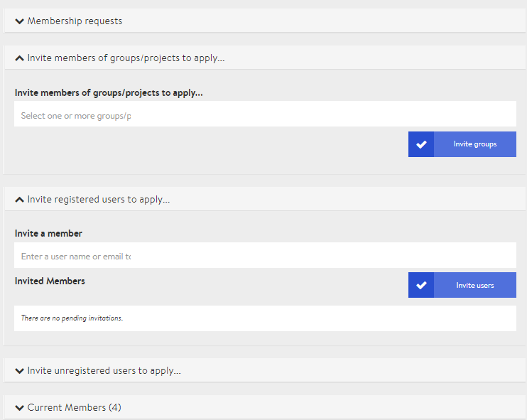

# Participant management

What would an event, meeting, gathering or conference be without an engaged community of interested people, participants, students or members? Preparing a virtual conference includes managing and adding participants whom we call members on our platform.

You can add registered users of the platform to a virtual conference on DINA as well as invite external participants with their email addresses. A simple form can also be activated on the conference microsite to allow interested people to register themselves.

First, however, we would like to give you an overview of the different roles at a virtual conference. Each role is associated with certain rights that provide it with different ways of interacting with the platform or within video conferences.

### Roles



Administrators - or admins that is - have access to all settings of the conference. They can change the visual appearance of the conference, create, edit and delete rooms and events, manage participants and have extended moderator rights in all video conferences.


Ideally, the number of administrators should be limited to a few people to prevent unwanted changes.




Presenters can be appointed by admins when creating or editing a specific event. They then have extended moderator rights in the video conference of the selected event. In all other rooms and events they only have normal participant rights.


If a person is to be given moderation rights at several events, then you must set him/her up as a presenter at each event.




Participants have no editing rights. They can enter all rooms \(shown\) and participate in the events taking place in them. Each person added to a session starts with participant rights. Admins can promote participants to administrators or appoint them as presenters in selected events.



Interpreters support the conference with simultaneous interpreting. As they need access to the technology, they must be assigned as administrators at the conference.



### Inviting participants

If you wish to access the participant management, please first navigate from the Admin page to the **"Members"** tab.

There are several ways of inviting people to a meeting. We mainly distinguish between the following:

* Someone is already registered on the platform or
* wants to participate in a conference as an external participant.

In the latter case, it is possible on the one hand to have a DINA account created in the course of registration, or - we are still working on this - to assign only temporary access in the context of a conference.


Depending on whether you have enabled or disabled the application form for participants in the conference settings, the options described below will have different names. In the following we will describe the situation when the application form is disabled.


#### Inviting platform users

Inviting people who are already active on DINA is particularly easy. If you are already in participant management, you will see the option "Invite registered users..." with a number in brackets. This number indicates how many platform users have already been invited and have not yet accepted their invitation. You can now simply type the beginning of a name into the input field and you will immediately receive suggestions. This allows you to gradually add users. Finally, you have to confirm your entry by clicking on the button "Invite users".


Small hint: As soon as the correct name is displayed in the first position, you can press Enter and enter the next name directly. This allows you to quickly enter several people one after the other and simultaneously invite them.


#### Inviting external users \(with registration with DINA\)

You can use the option "Invite non-registered users" to invite external participants who should create a DINA account directly when they accept the invitation. The number in brackets indicates how many external participants have already been invited and have not yet registered with DINA. Now click on the button "Invite people".

In the following view you can enter one or more email addresses in the corresponding field. Separate multiple addresses with a comma or use a separate line for each. If you wish, you can add a personal message to the invitation email. After you have confirmed with the button "Invite", all invited persons will receive an email with a link to register on DINA. After registering, they will be added directly to the conference as participants.

#### Invitation of external users \(without DINA registration\)

_This option has not yet been implemented._

### Managing membership applications

If an interested person has submitted a "membership application" or synonymously an application for admission via the conference microsite, they will appear under the tab **"Member applications"**. They can be accepted or rejected by a conference administrator. Once a decision has been made, all persons will receive a notification via the bell at the top right of the DINA platform and - with the appropriate notification settings - also via email. Accepted participants can now enter the conference.

### Managing current members

The tab **"Current members"** shows you all participants of the conference who have already been accepted. Next to the name on the left side you will find an email symbol on the right side which opens a \(Rocket\) chat with the person in question via the DINA platform. Next to the email icon you will see the role which can be either Admin or Member.

If you open the drop-down menu of a person, you have three options:

* **Report offensive content:** If someone has behaved against the DINA rules, you can report him/her to us. We will then take appropriate action.
* **Change role:** Use "As Member" or "As Admin" to change the person's role to member or admin of the conference.
* **Remove:** Removes the person from the conference. They will no longer be able to participate until they submit a new application for membership.

