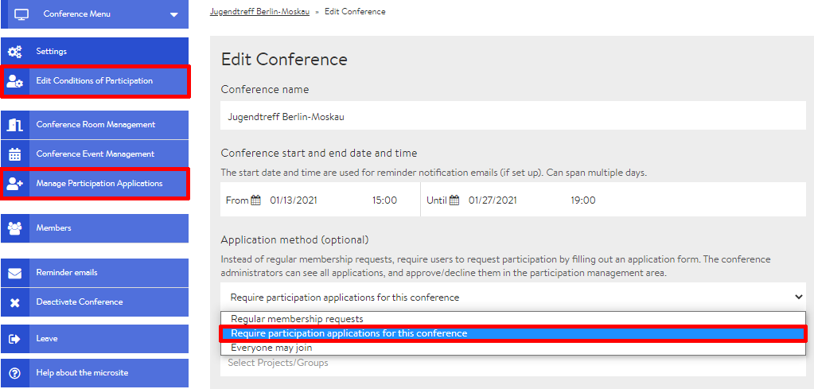
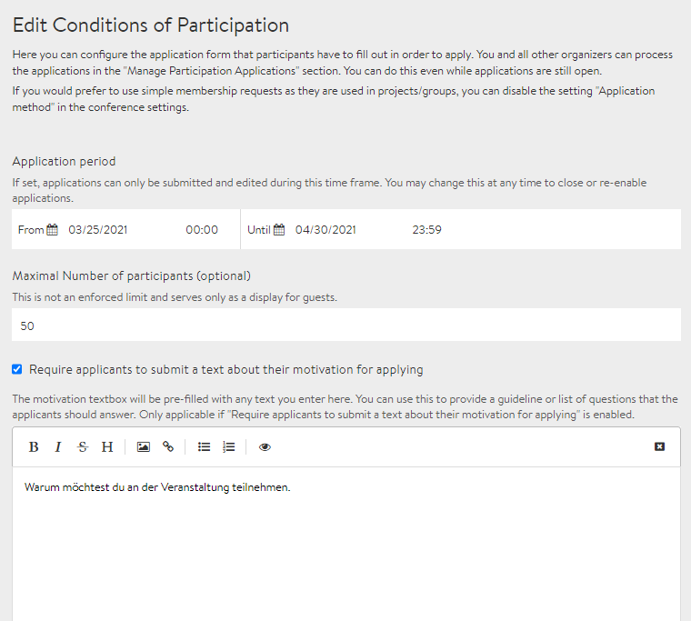
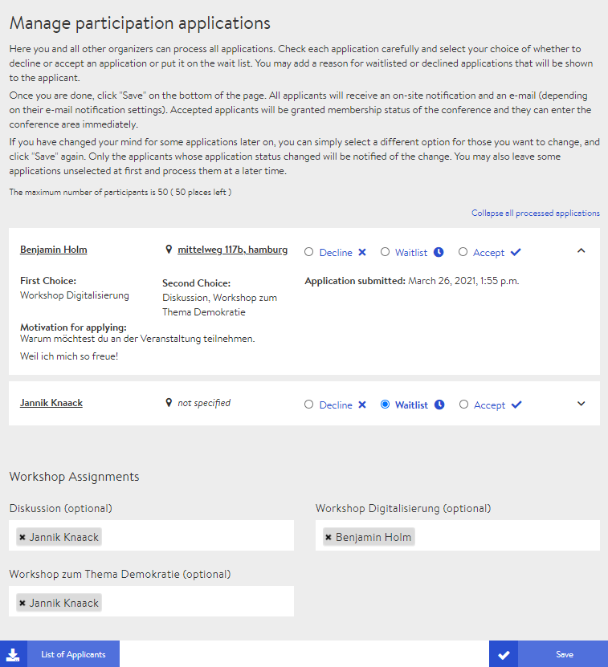

# Application Form

For larger events where you do not know all the participants or you need certain information from the participants, we recommend that you enable the application form in the conference settings. Those interested have to fill in this form as soon as they register for the conference via the microsite. As soon as you have activated the application form and saved the settings, two new tabs will appear on the admin page:

* Edit participation conditions
* Edit participation applications \(manage\)

### Editing the participation conditions

The tab **Edit participation conditions** hides the settings for the design of the application form which interested conference participants have to fill in when registering.

#### Registration deadline

If you enter a time period here, those interested can only register for the conference within this period. You can return to the settings at any time and shorten or extend this period.

#### Maximum number of participants \(optional\)

You can specify the maximum number of participants for guidance purposes. This will then be displayed on the microsite next to the number of participants already accepted.


If the maximum number of participants has already been exceeded, further applications will not automatically be placed on a waiting list. You can do this manually under **Edit participation applications**.


#### Motivational text for applicants \(optional\)

You can request a motivational text from the applicants. The text field can be used, e.g., to phrase questions for the applicants to answer.

#### Options for participation \(optional\)

Here, additional options can be offered for selection to those interested. This option is particularly useful for conferences that also take place in a presence setting. Details such as the request for vegetarian food or the need for overnight accommodation can be entered here.

#### Workshop selection \(optional\)

If you tick the checkbox for workshop selection, participants will be shown a list of all events already created in workshop rooms. They can then select all the ones they are interested in. This option is only relevant for organisers to better plan the group size of each workshop.

#### Participation conditions

Finally, you can set participation conditions all participants have to agree to before they can submit their application.

### Processing applications for participation

All applications submitted by those interested are listed under the tab **"Process applications for participation"**. Here you have access to the individual details of the applicants and can accept or reject the applications or put them on the waiting list. However, the decisions can be reversed at any time so you don't have to worry about excluding someone for good.


The waiting list is not an automatic, self-managed list, it is basically a status. If someone cancels, you have to change the status of another person from "Waiting list" to "Accept".


#### Assigning workshops

_In the future, it shall be possible to assign participants to specific events in workshop or discussion rooms. However, this function has not yet been implemented and the assignments do not \(yet\) show any effect._

