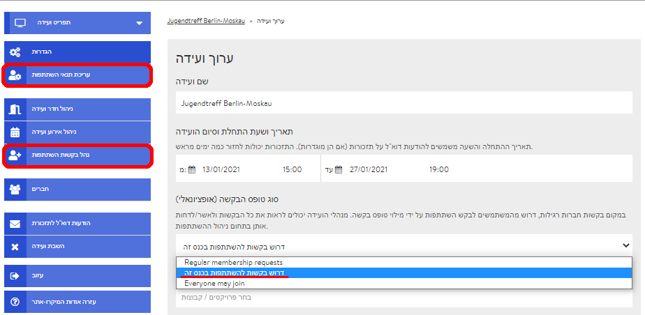
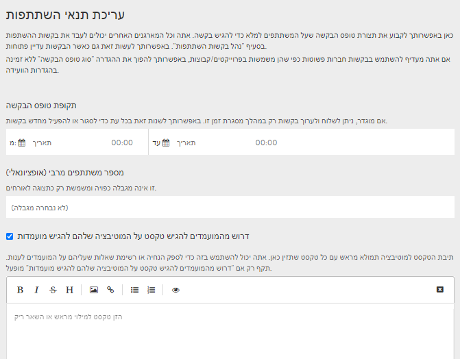
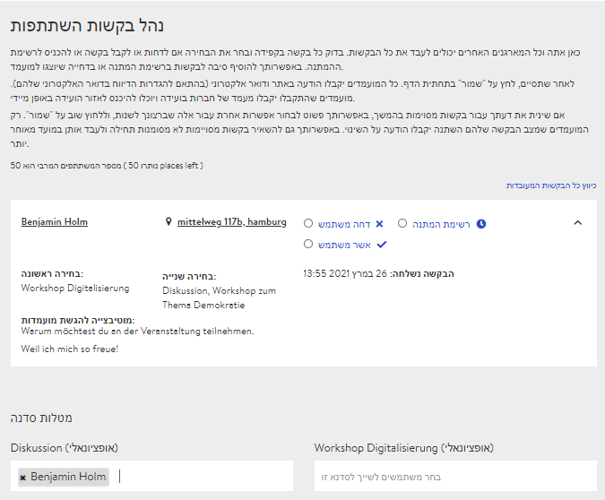

# טופס בקשה

באירועים גדולים יחסית שאינכם מכירים את כל המשתתפים בהם או שאתם זקוקים לפרטים מסוימים על המשתתפים, מומלץ להפעיל את טופס הבקשה בהגדרות המפגש. המעוניינים להשתתף במפגש ימלאו את הטופס בעת הרשמתם למפגש במיקרו-אתר. לאחר שתפעילו את טופס הבקשה ותשמרו את ההגדרות, יופיעו שני פריטים חדשים בתפריט בדף האדמין:

* •	עריכת תנאי השתתפות
* •	נהל בקשות השתתפות

### עריכת תנאי ההשתתפות

בלשונית **"עריכת תנאי השתתפות"** מצויות הגדרות טופס הבקשה שעל המעוניינים להירשם למפגש למלא בעת ההרשמה.

#### תקופת ההרשמה

אם תגדירו כאן תקופה, ההרשמה למפגש תהיה פתוחה בתקופה זו בלבד. תוכלו לחזור להגדרות אלה בכל עת ולקצר או להאריך את התקופה.

#### מספר משתתפים מרבי \(אופציונלי\)

תוכלו להציג את מספר המשתתפים המרבי, לידיעת המתעניינים בהשתתפות במפגש. המספר יוצג במיקרו-אתר ליד מספר הנרשמים שהשתתפותם כבר אושרה.


במקרה שאישרתם את השתתפותם של יותר משתתפים מאשר מספר המשתתפים המרבי שהגדרתם מלכתחילה, נרשמים נוספים לא יועברו לרשימת המתנה כברירת מחדל, אם כי אופציה זו קיימת, ועליכם להגדירה ידנית ב**"עריכת בקשות להשתתפות"**


#### מלל על מטרותיהם של המועמדים \(אופציונלי\)

באפשרותכם לבקש מהמועמדים לכתוב על מטרותיהם או על הגורמים שהביאו אותם להתעניין בהשתתפות במפגש. תוכלו להשתמש בתיבת הטקסט, לדוגמה כדי לנסח שאלות למועמדים.

#### אפשרויות ההשתתפות \(אופציונלי\)

כאן תוכלו להציג אפשרויות נוספות לבחירה. אופציה זו נועדה בעיקר למפגשים שנערכים גם פרונטלית, לדוגמה כדי לאפשר בקשות מיוחדות כגון לארוחות צמחוניות או לינה במקום.

#### בחירת סדנה \(אופציונלי\)

אם תסמנו וי בבחירת הסדנה, תוצג למשתתפים רשימה של כל האירועים שכבר נוצרו בחדרי הסדנאות. כך הם יוכלו לבחור את הסדנאות שהם מעוניינים להשתתף בהן. אפשרות זו רלוונטית למארגנים בלבד, כדי שיוכלו לתכנן טוב יותר את גודל הקבוצות.

#### תנאי השתתפות

לבסוף תוכלו לקבוע את תנאי ההשתתפות שכל המשתתפים יידרשו להסכים להם לפני הגשת המועמדות.

### עיבוד הבקשות להשתתפות

בלשונית **"עבד בקשות להשתתפות"** ירוכזו כל הבקשות שהגישו מועמדים להשתתפות במפגש. שם תוכלו לצפות בפרטים שמסרו המועמדים, ותוכלו לאשר / לדחות מועמדים או להעבירם לרשימת המתנה. תוכלו לשנות את החלטתכם בכל עת, ולכן אל דאגה – אם דחיתם מישהו, תוכלו לאשר את השתתפותו בדיעבד.


רשימת ההמתנה אינה מתפעלת את עצמה אוטומטית, אלא מציגה סטטוס בלבד. מכאן שאם משתתף מעדכן כי הוא מוותר על השתתפותו, עליכם לשנות את הסטטוס של אחד המועמדים מ"רשימת המתנה" ל"אשר".


#### הפניות לסדנה

_בעתיד כנראה תתאפשר הפניית משתתפים לסדנאות או לחדרי דיונים מסוימים. אפשרות זו עדיין לא יושמה, וההפניות \(עדיין\) אינן פעילות._

