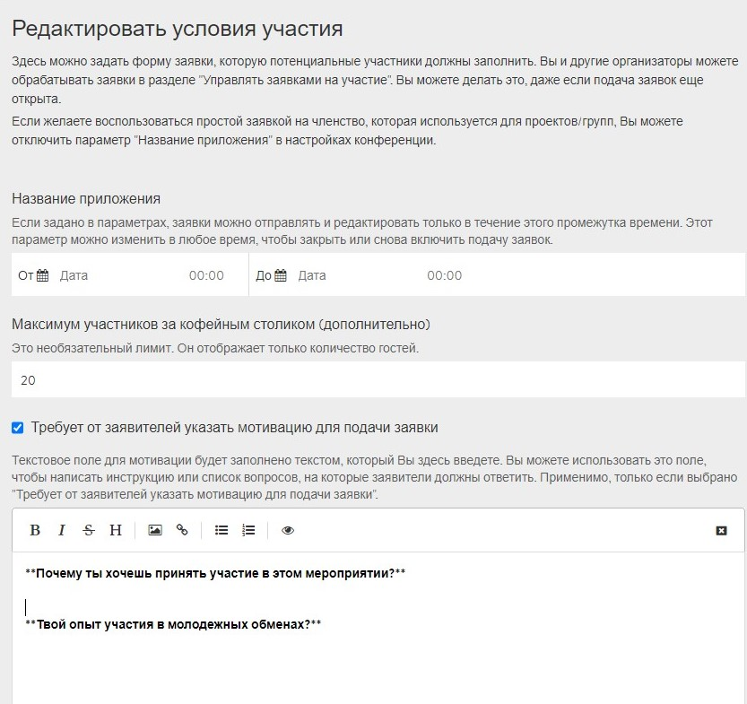
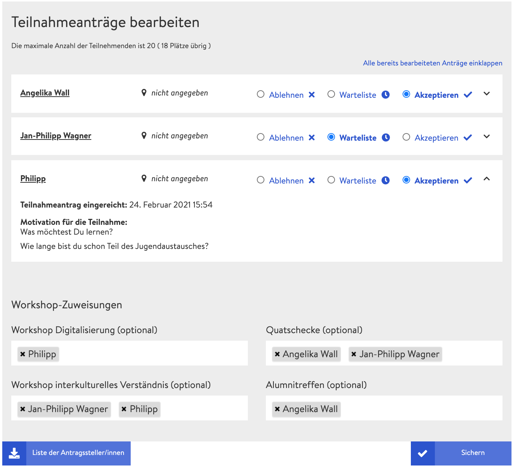

# Форма заявки

Для более масштабных мероприятий, где ты не знаешь всех участников или где тебе нужна определенная информация от участников, советуем активировать форму заявки в настройках конференции. Интересенты конференции должны заполнить ее, как только они зарегистрируются на конференцию через микросайт. После активации формы заявки и сохранения настроек на странице администратора появляются две новые вкладки:

* Редактировать условия участия
* Редактировать заявки \(управлять заявками на участие\)

### Редактирование условий участия

За вкладкой **«Редактировать условия участия»** прячутся настройки формы заявки, которую участники конференции должны заполнить при регистрации.

#### Срок регистрации

Если ты укажешь здесь определенный период времени, то участники могут зарегистрироваться на конференцию только в течение этого периода. Ты в любое время можешь вернуться к настройкам и сократить или продлить этот период.

#### Максимальное число участников \(не обязательно\)

Ты можешь отобразить максимальное количество участников, которое будет указано на микросайте рядом с числом уже принятых участников.


Если максимальное количество участников превышено, то дальнейшие заявки не будут автоматически помещаться в список ожидания. Это ты можешь сделать вручную под опцией **«Редактировать заявки на участие»**.


#### Мотивационный текст для заявителей \(опционально\)

У тебя есть возможность запросить от заявителей мотивационный текст. Соответствующее текстовое поле ты можешь использовать, например, для формулировки вопросов в адрес заявителей, на которые они затем должны ответить.

#### Варианты участия \(не обязательно\)

Здесь можно предлагать дополнительные опции, которые могут выбрать участники. Этот вариант особенно целесообразен для конференций, где участники физически присутствуют на ней. Например, в этой рубрике можно указать, что необходимо вегетарианское питание или проживание.

#### Выбор семинара \(не обязательно\)

Если ты поставишь галочку на «Выбор воркшопа», участникам будет показан список всех мероприятий, уже созданных в семинарских помещениях \(воркшопах\). Участники могут выбрать те из них, которые их интересуют. Эта опция имеет значение только для организаторов, чтобы лучше планировать размер групп, участвующих в семинарах.

#### Условия участия

В качестве последнего шага ты можешь определить условия участия, с которыми должны согласиться все участники перед тем, как отправить заявку.

### Редактирование заявок на участие

Под вкладкой **«Редактировать заявки на участие»** собираются все заявки, которые уже поступили от участников конференции. Здесь ты можешь ознакомиться с индивидуальной информацией заявителей и принять или отклонить заявки либо занести их в список ожидания. Однако соответствующие решения можно в любое время отменить, так что тебе не надо беспокоиться о том, что ты кого-то окончательно исключил.


Список ожидания не является автоматическим самоуправляемым списком, а, скорее статусом. В случае, если кто-то отказывается от участия в конференции, ты должен изменить статус другого лица со «Списка ожидания» на «Принять».


#### Зачисление на семинары

_Предполагается, что в будущем появится возможность зачислять участников на определенные мероприятия в семинарских или дискуссионных помещениях. Однако на сегодня эта функция еще не работает и зачисления \(пока еще\) не имеют эффекта._

