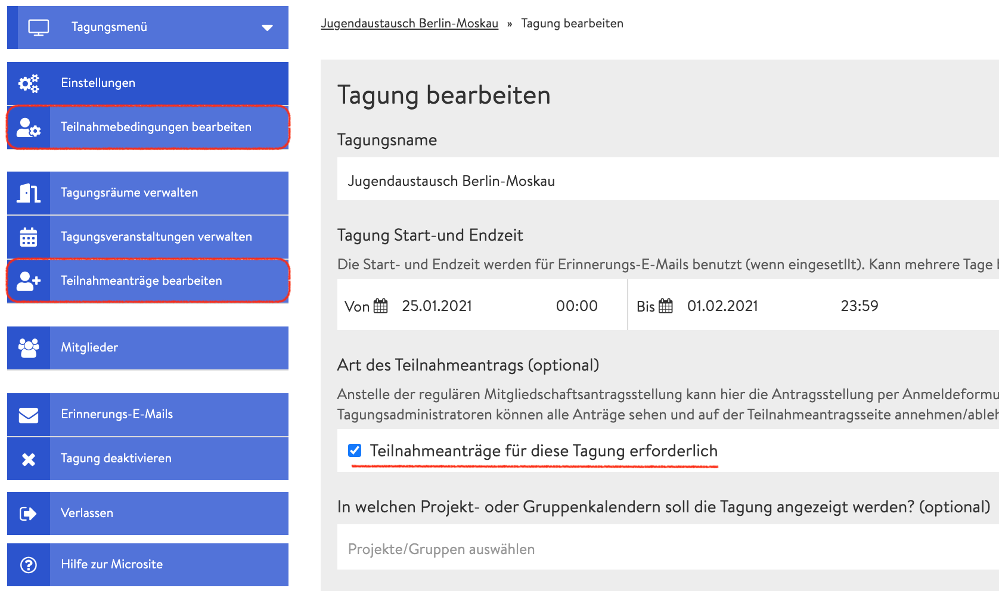
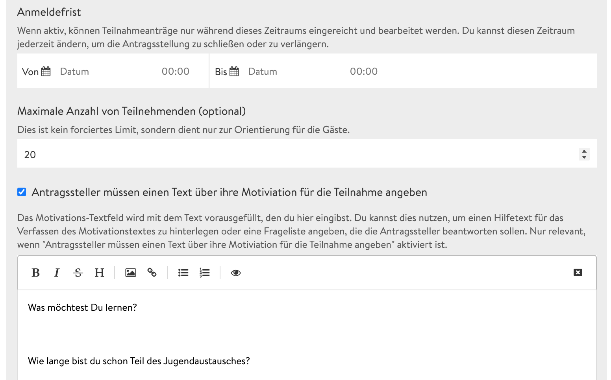

# Antragsformular

Bei größeren Veranstaltungen, bei der Du nicht alle Teilnehmenden kennst oder du bestimmte Informationen von den Teilnehmenden benötigst, empfehlen wir Dir, das Antragsformular in den [Tagungseinstellungen](../start/) freizuschalten. Dieses müssen Tagungsinteressierte ausfüllen, sobald sie sich über die Microsite für die Tagung anmelden. Sobald Du das Antragsformular aktiviert und die Einstellungen gespeichert hast, erscheinen auf der Admin Seite zwei neue Reiter:

* Teilnahmebedingungen bearbeiten
* Teilnahmeanträge bearbeiten \(verwalten\)

### Teilnahmebedingungen bearbeiten

Hinter dem Reiter **Teilnahmebedingungen bearbeiten** verstecken sich die Einstellungen zum Erscheinungsbild des Antragsformulars, welches Tagungsinteressierte bei Anmeldung ausfüllen müssen.

#### Anmeldefrist

Wenn Du hier einen Zeitraum angibst, dann können sich Interessierte nur innerhalb dieses Zeitraums für die Tagung anmelden. Du kannst jederzeit zu den Einstellungen zurückkehren und den Zeitraum verkürzen oder verlängern.

#### Maximale Anzahl von Teilnehmenden \(optional\)

Du kannst als Orientierung die maximale Anzahl an Teilnehmenden bekanntgeben. Diese wird dann auf der Microsite neben der Anzahl der bereits akzeptierten Teilnehmenden angezeigt. 


Falls die maximale Anzahl an Teilnehmenden bereits überschritten ist, werden weitere Anmeldungen nicht automatisch auf eine Warteliste gesetzt. Das kannst du manuell unter **Teilnahmeanträge bearbeiten** tun.


#### Motivationstext für Antragsteller\*innen **\(optional\)**

Du hast die Möglichkeit, einen Motivationstext von Antragsteller\*innen zu verlangen. Das Textfeld kannst Du beispielsweise dafür verwenden, um Fragen an die Antragstellenden zu formulieren, die diese dann beantworten sollen.

#### Möglichkeiten zur Teilnahme \(optional\)

Hier lassen sich zusätzliche Optionen anbieten, welche Interessierte  anwählen können. Diese Option ist vor allem für Tagungen sinnvoll, die zusätzlich auch in Präsenz stattfinden. Es können hier beispielsweise Angaben wie der Wunsch nach vegetarischem Essen oder die Notwendigkeit einer Übernachtungsmöglichkeit gemacht werden. 

#### Workshopauswahl \(optional\)

Setzt Du das Häkchen bei Workshopauswahl, dann wird den Teilnehmenden eine Liste aller bereits angelegten Veranstaltungen in Workshopräumen angezeigt. Sie können dann alle anwählen, für die sie sich interessieren. Diese Option ist nur für Organisator\*innen von belang, damit die Gruppengröße der Workshops besser geplant werden kann.

#### Teilnahmebedingungen

Als Letztes kannst du noch Teilnahmebedingungen festlegen, denen alle Teilnehmenden zustimmen müssen, bevor sie ihren Antrag abschicken können.

### Teilnahmeanträge bearbeiten

Unter dem Reiter **Teilnahmeanträge bearbeiten** laufen alle bereits abgeschickten Anträge von Tagungsinteressierten auf. An dieser Stelle hast Du Einsicht in die individuellen Angaben der Antragstellenden und kannst die Anträge annehmen, ablehnen oder auf die Warteliste setzen. Die Entscheidungen können jedoch jederzeit rückgängig gemacht werden, sodass Du keine Sorge haben musst, jemanden endgültig auszuschließen.


Die Warteliste ist keine automatische, selbstverwaltete Liste, sondern im Grunde ein Status. Sollte jemand absagen, dann musst Du den Status einer anderen Person von "Warteliste" auf "Akzeptieren" setzen.


#### Workshop-Zuweisungen

_Es soll in der Zukunft möglich sein, Teilnehmende bestimmten Veranstaltungen in Workshop oder Diskussionsräumen zuzuweisen. Diese Funktion ist allerdings noch nicht implementiert und die Zuweisungen zeigen \(noch\) keinen Effekt._

