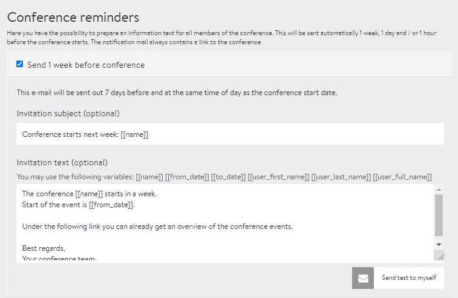

# Reminder emails

You probably know the feeling: You have registered for a cool event weeks ago and then you realise: “Damn, I missed it!” To prevent this from happening to your participants and to increase the attendance rate, DINA allows you to formulate automatic reminder emails. You can prewrite up to 3 reminder emails that are sent to participants a week, a day or an hour before the event. You can find the settings for this under the tab **Reminder emails** in the admin area.


On the screenshot above you can see so-called shortcodes \(variables\). \[\[**name**\]\], e.g., is automatically replaced by the name of the conference in the email. However, you can also simply write out the name. The shortcodes are practical, however, if you change the name of the conference or the time.


