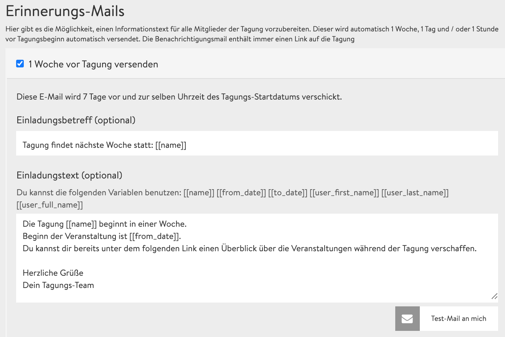

# Ε-mail Υπενθύμισης

Μάλλον, το έχετε ξαναζήσει: Έχετε εγγραφεί σε μια ενδιαφέρουσα εκδήλωση πριν από εβδομάδες και ξαφνικά συνειδητοποιείτε: «Να πάρει η ευχή! Το έχασα!». Για να το αποφύγετε και να αυξήσετε το ποσοστό συμμετοχής, η πλατφόρμα DINA σας επιτρέπει να συντάξετε αυτοματοποιημένα e-mail υπενθύμισης. Μπορείτε να συντάξετε εκ των προτέρων έως και 3 e-mail υπενθύμισης, που αποστέλλονται στους συμμετέχοντες μία εβδομάδα, μία ημέρα ή μία ώρα πριν από την εκδήλωση. Στην καρτέλα **E-mail Υπενθύμισης,** στο [πεδίο διαχείρισης](https://app.gitbook.com/@dina-international/s/manual/v/gre/funktionalitaeten/admin-page), μπορείτε να βρείτε τις σχετικές ρυθμίσεις.


Στο παραπάνω στιγμιότυπο οθόνης μπορείτε να δείτε τις λεγόμενες «έτοιμες φράσεις» \(μεταβλητές\). Το **\[\[όνομα\]\],** π.χ., αντικαθίσταται αυτόματα από τον όνομα του συνεδρίου στο e-mail. Ωστόσο, μπορείτε απλώς να γράψετε το όνομα. Αλλά οι «έτοιμες φράσεις» είναι πρακτικές, εάν αλλάξετε το όνομα του συνεδρίου ή την ώρα.


