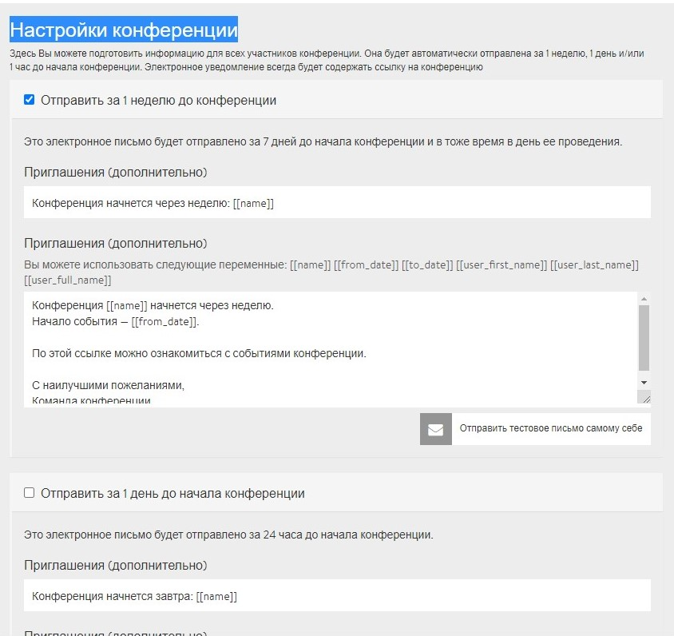

# Электронные письма-напоминания

Тебе, наверное, знакома следующая ситуация: ты уже несколько недель тому назад заявился на крутое мероприятие, и вдруг понимаешь: «Черт, я забыл о нем!». Чтобы этого не случилось с твоими участниками и чтобы увеличить посещаемость, платформа DINA предлагает тебе возможность рассылать автоматические письма-напоминания по электронной почте. Ты можешь предварительно сформулировать до трех писем-напоминаний, которые будут направлены участникам за неделю, за один день или за один час до начала мероприятия. Настройки для этого можно найти под вкладкой **«Электронные письма с напоминанием»** на странице администратора.


На скриншоте сверху можно увидеть так называемые ярлыки \(**переменные**\). \[\[**имя**\]\], например, в электронном письме будет автоматически заменено названием конференции. Но ты также можешь просто выписать соответствующее название. Эти ярлыки практичны, если ты хочешь изменить, например, название конференции или время ее проведения.


