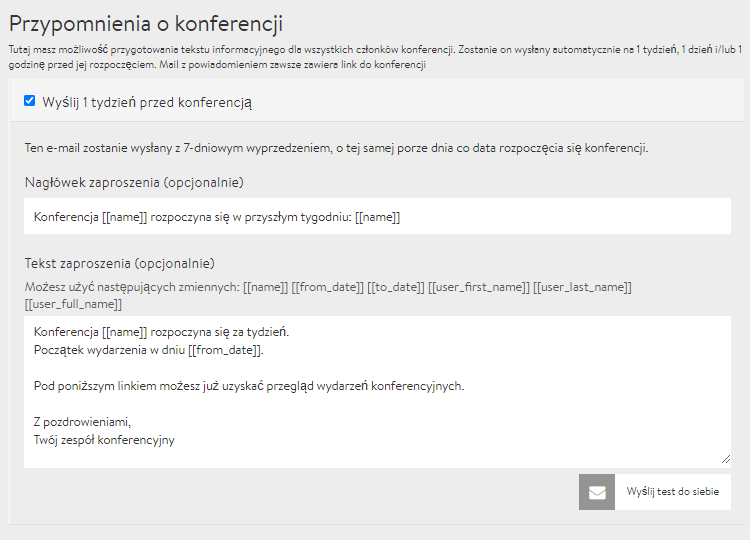

# Erinnerungsmails

Wahrscheinlich kennst Du das auch: Du hast dich vor Wochen bei einem coolen Event angemeldet und dann stellst Du fest: "Mist, ich habs verpasst!". Um Deine Teilnehmenden davor zu bewahren und die Anwesenheitsquote zu erhöhen, bietet Dir DINA die Möglichkeit, automatische Erinnerungsmails zu formulieren. Du kannst bis zu 3 Erinnerungsmails vorformulieren, die eine Woche, einen Tag oder eine Stunde vorher an die Teilnehmenden verschickt werden. Du findest die Einstellungen dazu unter dem Reiter **Erinnerungsmails** im [Admin Bereich](../admin-page.md).


Auf dem Screenshot oben siehst Du sogenannte Shortcodes \(Variablen\). **\[\[name\]\]** z.B. wird in der Email automatisch durch den Namen der Tagung ersetzt. Du kannst den Namen aber auch einfach ausschreiben. Praktisch sind die Shortcodes jedoch, wenn du beispielsweise den Namen der Tagung oder die Uhrzeit ändern solltest. 


