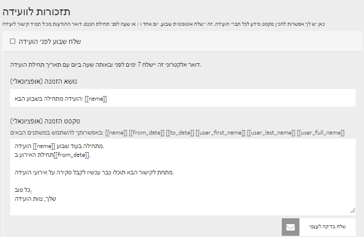

# הודעות תזכורת במייל

זה בטח מוכר לכם: לפני כמה שבועות נרשמתם לאירוע מבטיח, ואז פתאום אתם מגלים: "מה, איך קרה? שכחנו לגמרי, החמצנו את זה!". כדי שזה לא יקרה למשתתפים שלכם, וכדי להבטיח שיעור נוכחות מרבי, DINA מאפשרת לכם לנסח הודעות תזכורת אוטומטיות. תוכלו לנסח מראש שלוש הודעות תזכורת במייל שיישלחו למשתתפים שבוע, יום ושעה מראש. ההגדרות מצויות בלשונית **"תזכורות לוועידה"** באזור האדמין.


בצילום המסך שלעיל אפשר לראות את הגדרת השדות של המשתנים \(Shortcodes\). לדוגמה, **\[\[name\]\]** יוחלף במייל אוטומטית בשם המפגש, אם כי יש גם אפשרות לכתוב את השם המלא בעצמכם. השימוש ב- Shortcodesנוח במקרים שתרצו לשנות, לדוגמה, את שם המפגש או את השעות.


