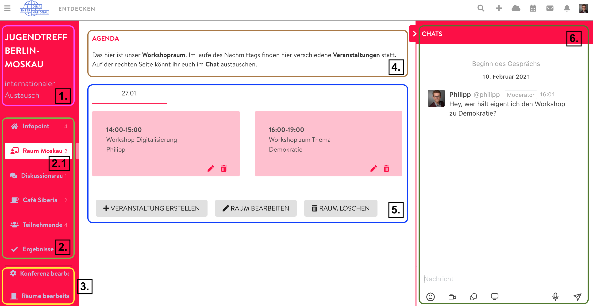
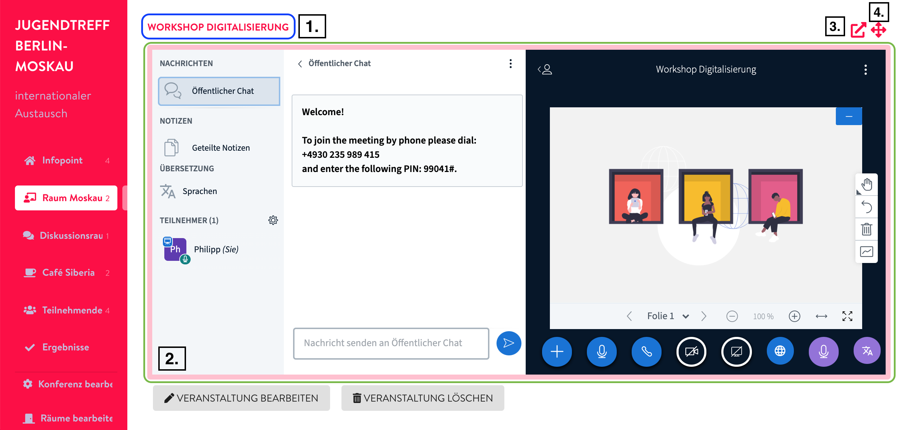
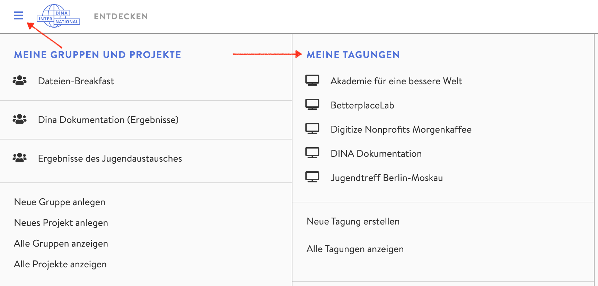

# Náhled konference

### Základní struktura

Podobu své digitální konference si můžete upravovat sami. Abyste ale měli představu, jak vypadá struktura celého konferenčního centra, uvedeme příklad. Barvy, popisky, názvy místností a událostí si můžete u svých akcí určovat dle libosti. Ovládací tlačítka, která v příkladu vidíte, se zobrazují pouze správcům konference.

1. Název a popis konference
2. Místnosti

   2.1 Aktivní místnost

3. Nastavení / správcovská stránka
4. Popis místnosti
5. Události v aktivní místnosti a možnosti
6. Okno chatu \(propojeno s Rocket.Chatem – všechny zprávy, které si zde vyměníte, najdete také ve svých konverzacích v chatu DINA\)

### Místnost pro události s videem

Pokud kliknete na událost v [seminární místnosti](../rooms/#raumtyp), [diskuzní místnosti](../rooms/#raumtyp) nebo [kavárně](../rooms/#raumtyp) otevře se zde videokonference probíhající díky softwaru BigBlueButton. Pokud jsou v tu chvíli k videokonferenci připojené další osoby s aktivní kamerou, můžete začít komunikovat pomocí zvuku a obrazu. Další informace o používání BigBlueButton naleznete [zde](../bigbluebutton/).

1. Název události
2. Videokonference BigBlueButton
3. Otevření videokonference na nové záložce prohlížeče
4. Zvětšení náhledu videa \(místnosti na levé straně zmizí, vrátit se můžete pomocí stejného tlačítka\)

Kromě místností s videem existují ještě další [typy místností](../rooms/#raumtyp), projděte si je😉.

### Zobrazení náhledu konference

K náhledu konference se dostanete dvěma způsoby:

* přes správcovskou stránku konference nebo
* přes ikonu tří vodorovných proužků v menu DINA

Ze správcovské stránky se k náhledu konference dostanete snadno přes menu konference a pak přes záložku **Konference**.

Náhled konference si můžete zobrazit také kdykoliv kliknutím na ikonu tří proužků v menu DINA:

