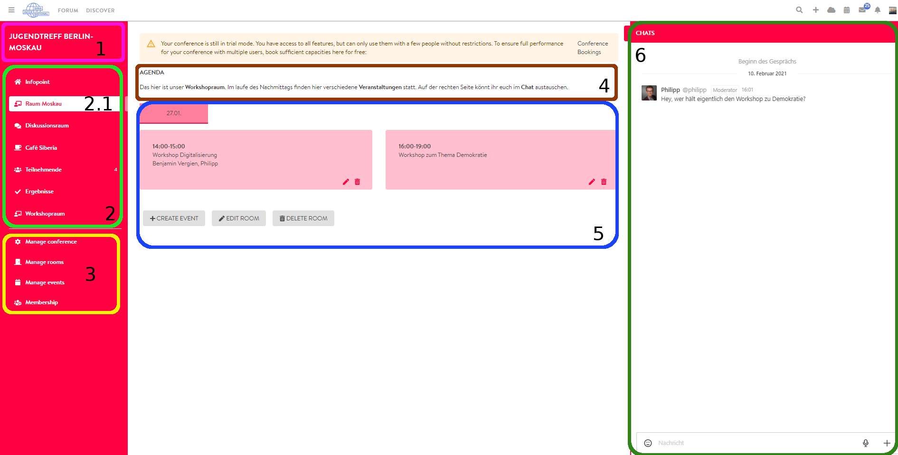
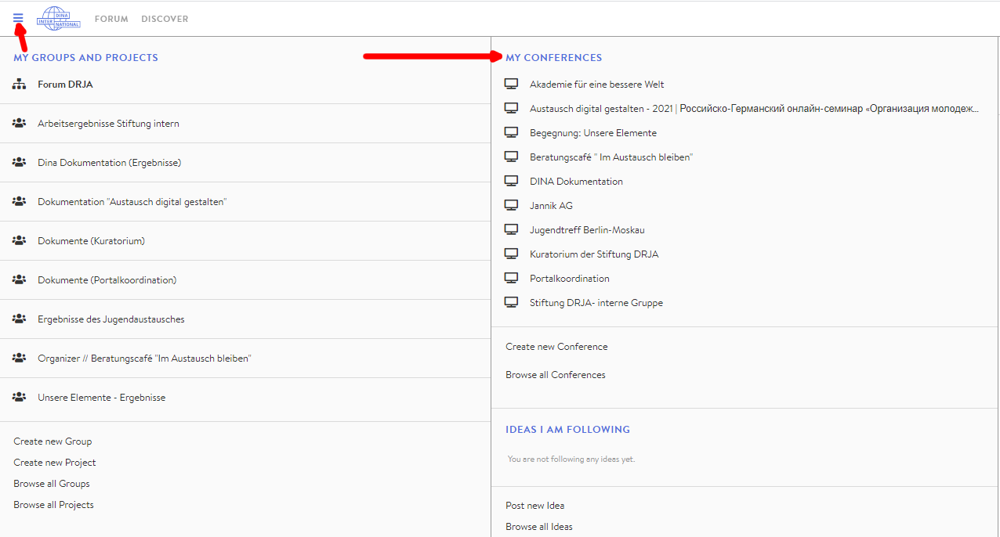

# Conference View / Dashboard

### Basic structure

You can design the look of your digital conference yourself, but to give you an idea of how the conference centre is structured, we will provide you with an example here. You can freely determine the colours as well as the description texts, room and event names for your own event. The settings buttons shown in this example are only displayed to conference administrators.

1. Title and description of the conference
2. Rooms

   2.1 Active room

3. Go to settings page / Go to admin page
4. Description of the room
5. Events in the active room and further options
6. Chat window \(linked to Rocket.Chat – all messages you exchange here, can also be found in your conversations via the DINA chat function\)

### Room with a video event

If you click on an event in a workshop, discussion or café room, BigBlueButton will open in this room. If other people with an activated camera are in this video conference, you can communicate in audio and video. For more information on using BigBlueButton, please click here.

1. Event name
2. BigBlueButton video conference
3. Open the video conference in a new browser tab
4. Zoom in the video view \(rooms on the left side are hidden, can be reversed via the same button\).

In addition to the video rooms there are several other types of rooms. Just give them a try!😉.

### Open conference view

There are two ways of accessing the conference view:

* via the Admin page of the
* conference or via the DINA hamburger button

From the conference admin page, you can easily access the conference view via the conference menu and then via the **"Conference"** tab.

You can also use DINA's hamburger button to access the conference view at any time:

