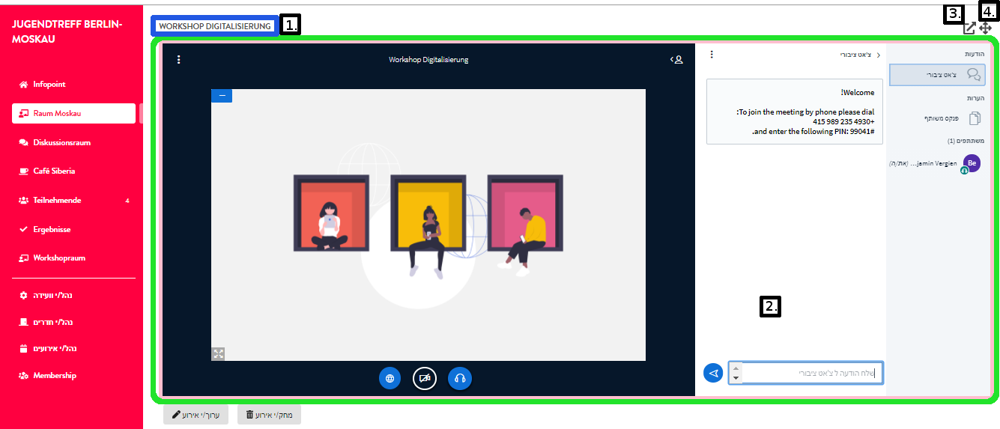

# תצוגת מפגש / דשבורד

### מבנה כללי

באפשרותכם לעצב את המפגש הדיגיטלי שלכם בעצמכם. נציג כאן דוגמה להמחשת מבנה בית המפגשים. באירוע שלכם תוכלו לבחור הן את הצבעים והן את התיאורים המלווים ואת שמות החדרים והאירועים. כפתורי הכוונונים המוצגים בדוגמה זו יוצגו לאדמינים בלבד.

1. 1.	כותרת ותיאור המפגש
2. 2.	חדרים

   2.1 חדר פעיל

3. 3.	להגדרות / לדף האדמין
4. 4.	תיאור החדר
5. 5.	אירועים בחדר הפעיל ואפשרויות
6.  צ'אט – מקושר עם רוקט צ'אט. כל ההודעות שאתם מחליפים כאן נמצאות גם בצ'אטים שלכם בפונקציית הצ'אט של DINA

### חדר לאירוע וידיאו

אם תקליקו בחדר סדנה, בחדר דיון או בחדר קפה על אירוע, ייפתח חדר זה ב-BigBlueButton. אם יימצאו משתתפים אחרים שהמצלמה שלהם מופעלת באותה ועידת וידיאו, תוכלו לתקשר עמם בקול ובתמונה. מידע נוסף על השימוש ב-BigBlueButton תמצאו כאן:

1. 1.	שם האירוע
2. 2.	ועידת וידיאו באמצעות BigBlueButton
3. 3.	פתח ועידת וידיאו בלשונית חדשה בדפדפן
4. 4.	הגדל את תצוגת הווידיאו: החדרים בצד שמאל יוחשכו. פעולה זו ניתנת לביטול באמצעות אותו כפתור.

לצד חדרי הווידיאו יש גם סוגים אחרים של חדרים. פשוט תתנסו קצת  .

### בחירה של תצוגת המפגש

יש שתי דרכים להגיע לתצוגת המפגש:

* •	דרך דף האדמין של המפגש
* •	דרך תפריט שלושת הפסים של DINA

אפשר להגיע מדף האדמין לתצוגת המפגש בדרך פשוטה מתפריט המפגש והלשונית **"מפגש"**.

ואפשר להגיע לתצוגת המפגש גם דרך התפריט המשולש של DINA:

