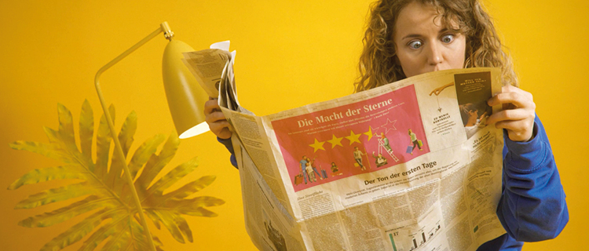

# אירועים

כדי שיוכל להתרחש משהו בחדר האירועים, דרושים אירועים. אירועים שונים יכולים להתרחש בחדרים שונים או גם באותו חדר, בעת ובעונה אחת. לדוגמה, בחדר קפה אפשר להציב כמה שולחנות קפה וירטואליים, ובחדר סדנה יכולות להיערך שתי סדנאות בד בבד. בזכות הקירות האקוסטיים הווירטואליים שלנו לא תפריעו אלה לאלה, מבטיחים😉. 

בדרך כלל, אירועים כוללים אפשרות וידיאו, אבל לא בכל סוג של חדר אפשר ליצור אירועים. כך לדוגמה, ברשימת המשתתפים או בחדר תוצאות אין הרבה התרחשות. בלובי אמנם אפשר ליצור אירועים, אך אלה משמשים רק כ"פילרים" בלוח הזמנים, ואינם כוללים אפשרות וידיאו, לדוגמה אם תרצו לשלב בתוכנית הפסקה כללית.

### הוספת אירועים חדשים


כדי ליצור אירועים, תחילה עליכם ליצור חדרים.


ליצירת אירוע חדש יש שתי אפשרויות: האחת היא, אם אתם בשלב קביעת האפיונים הכלליים של המפגש – אתם כנראה בדף האדמין. משם תוכלו לעבור ללשונית **"ערוך חדר ועידה"**. בלשונית זו, בצד ימין, מוצגת רשימת החדרים שיצרתם לפי הספרור שקבעתם להם. תוכלו לפתוח כל פריט בלחיצה על החץ. בתפריט שייפתח, מלבד "ערוך" ו"מחק" תוצג גם האפשרות "יצירת אירוע חדש".

האפשרות השנייה ליצירת אירוע חדש היא מתצוגת המפגש. אם כאדמין אתם בחדר אירועים, יוצג מתחת לתיאור החדר כפתור להוספת אירועים חדשים. משם תוכלו גם לערוך או למחוק אירועים קיימים. להלן נתאר בקצרה את ההגדרות האפשריות בעת הוספת אירועים חדשים. נדגיש כי בדומה להוספת חדרים – גם בהוספת אירועים אפשר לשנות הגדרות גם בדיעבד.

### הגדרות האירועים

#### כותרת

רצוי שהכותרת תשקף את תוכן האירוע באופן מיטבי, בייחוד כשמדובר באירועים בחדרי סדנה. גם את ה"שולחנות" בחדר קפה תוכלו כמובן לשיים כאוות נפשכם. לדוגמה, אירוע יכול לשאת את הכותרת "הרצאה מאת ד"ר כהן בנושא יחסי גרמניה–ישראל" או "דיון קבוצתי על הדמוקרטיה הדיגיטלית". בחרו שם כיד הדמיון הטובה עליכם.

#### הגדרת אירוע כהפסקה \(אופציונלי\)

אם הגדרתם אירוע כהפסקה, לא תהיה לאירוע זה אפשרות וידיאו, והוא יהווה פילר בלבד. ליתר פירוט, כדאי להגדיר את אירוע כזה  כהפסקת צהריים או כהפסקת בוקר.

#### תאריך ושעה

באפשרות זו הגדירו את לוח הזמנים של האירוע. האירוע ימוין בבית המפגשים לפי התאריך והתזמון שקבעתם, ויוצג בתפריט לפי ימים. אירוע שנערך באותה עת יוצג למשתתפים בהדגשה.

#### תיאור \(אופציונלי\)

בתיאור האירוע ניתן לסכם את תוכן האירוע בקצרה. התיאור יופיע במקום המיועד בלוח הזמנים ליד אותו אירוע. עם זאת, עדיף להשתמש במקום המיועד לתיאור החדר לצורך זה, שכן בסקירת האירוע אין הרבה מקום לטקסט.

#### מגישים / מרצים / מנחים \(אופציונלי\)

באירועים יש לעיתים קרובות מגיש או מנחה או כמה מגישים או מנחים. הם עשויים להיות זקוקים להרשאות מורחבות בוועידת וידיאו, לדוגמה כדי לפצל את המסך, לנהל את המשתתפים, ליצור חדרים פרטיים או ליזום סקרים. באמצעות אפשרויות הניהול תוכלו בקלות להעניק למשתתפים מסוימים במפגש הרשאות מורחבות לצורך אותו אירוע. לשם כך, הזינו את השם או השמות בתיבת הטקסט ובחרו אותם ברשימה הנפתחת.


ההרשאות המורחבות של מי שנבחר חלות על ועידת הווידיאו BigBlueButton של אותו אירוע בלבד. אם תרצו למנות אדמינים נוספים לכל המפגש, הדבר אפשרי באמצעות ניהול משתתפים. לאדמינים של המפגש יוענקו הרשאות מורחבות בכל ועידת וידיאו אוטומטית.


#### העלאת מצגת \(אופציונלי\)

DDINA מאפשרת אופציה נוחה להעלאת מצגות לפני האירוע שיוצגו למשתתפים במשך ועידת הווידיאו. המצגות גם ניתנות להורדה על פי בקשה. האופציה תומכת בפורמטים PDF, קובצי תמונה ואופיס. מגישים או אדמינים יוכלו להעלות מצגות גם תוך כדי ועידת הווידיאו.


לצורך הצגת המצגות BigBlueButton תמיר את המסמכים שהועלו לפורמט PDF. עקב כך יאבדו מצגות פאואר פוינט את האנימציות והמעברים שלהן. אבל אין בעיה, מצגת פאואר פוינט הכוללת אנימציות תוכל לפעול באמצעות האפשרות לפיצול המסך😊.


אם מילאתם את כל שדות החובה, תוכלו לשמור את האירוע, והוא יופיע מיד בתצוגת המפגש בחדר המתאים.

### עריכת אירועים

שינוי הגדרה כלשהי מהגדרות האירוע בשלב מאוחר יותר – לדוגמה את הכותרת, השעה או את שם המגיש או שמות המגישים – אפשרי בקלות בשתי דרכים לבחירתכם: 

מתצוגת המפגש היכנסו לחדר של האירוע הרלוונטי. בפינה הימנית של האירוע מופיע סמל קטן של עיפרון שבלחיצה עליו אפשר לפתוח את עמוד העריכה.

לחלופין, אם אתם נמצאים בדף האדמין, לחצו על הלשונית "עריכת אירועי המפגש". שם לחצו על האירועים הרלוונטיים כדי להעלות את עמוד העריכה.

### מחיקת אירוע

אפשר למחוק אירועים בדומה לעריכת אירועים:

בתצוגת המפגש כנסו לחדר של האירוע הרלוונטי. בפינה הימנית של האירוע מופיע סמל קטן של פח אשפה, שבאמצעותו אפשר למחוק את האירוע.

אם אתם נמצאים בדף האדמין, בחרו את הלשונית "ניהול אירוע מפגש". שם פתחו את תפריט האירוע שברצונכם למחוק כדי להגיע לכפתור.


שימו לב: מחיקת אירוע היא בלתי הפיכה. לפיכך, שקלו היטב תחילה לערוך את האירוע במקום למחוק אותו.


